# 项目完整运行流程分析

## 示例程序

```lox
var a = 1;
{
    var a = 2;
    var b = 3;
    print a;
    print b;
}
```

预期输出：

```
2
3
```

---

## 整体架构

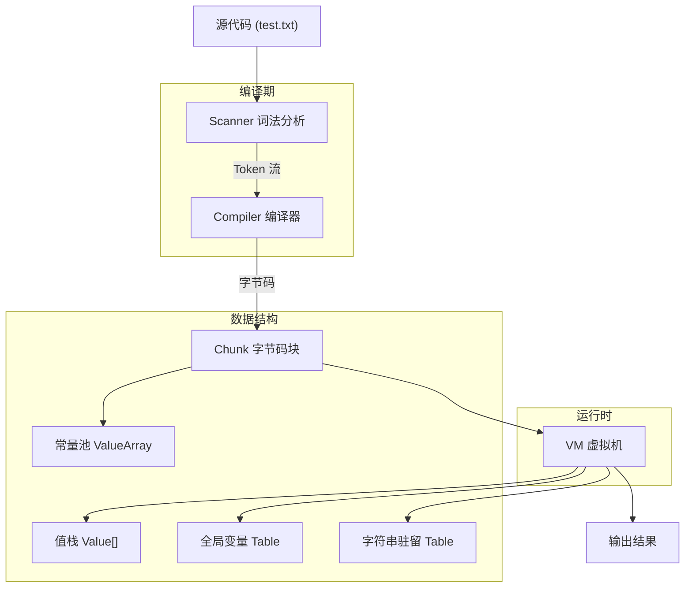

---

## 阶段一：入口与初始化（main.c）

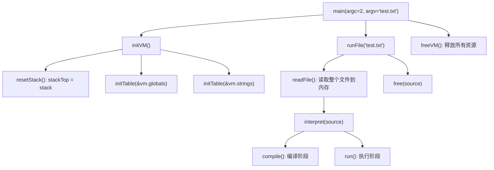

`main.c` 根据命令行参数决定执行模式：
- `argc == 1`：REPL 逐行模式
- `argc == 2`：脚本模式，`readFile()` 一次性读入整个文件，交给 `interpret()` 编译执行

---

## 阶段二：词法分析（scanner.c）

Scanner 将源代码拆分为 Token 流：

```
源代码: var a = 1; { var a = 2; var b = 3; print a; print b; }

Token 流:
 ┌──────────────────┬──────────────────┬──────────────┐
 │ Token 类型        │ 词素 (lexeme)    │ 行号          │
 ├──────────────────┼──────────────────┼──────────────┤
 │ TOKEN_VAR        │ "var"            │ 1            │
 │ TOKEN_IDENTIFIER │ "a"              │ 1            │
 │ TOKEN_EQUAL      │ "="              │ 1            │
 │ TOKEN_NUMBER     │ "1"              │ 1            │
 │ TOKEN_SEMICOLON  │ ";"              │ 1            │
 │ TOKEN_LEFT_BRACE │ "{"              │ 2            │
 │ TOKEN_VAR        │ "var"            │ 3            │
 │ TOKEN_IDENTIFIER │ "a"              │ 3            │
 │ TOKEN_EQUAL      │ "="              │ 3            │
 │ TOKEN_NUMBER     │ "2"              │ 3            │
 │ TOKEN_SEMICOLON  │ ";"              │ 3            │
 │ TOKEN_VAR        │ "var"            │ 4            │
 │ TOKEN_IDENTIFIER │ "b"              │ 4            │
 │ TOKEN_EQUAL      │ "="              │ 4            │
 │ TOKEN_NUMBER     │ "3"              │ 4            │
 │ TOKEN_SEMICOLON  │ ";"              │ 4            │
 │ TOKEN_PRINT      │ "print"          │ 5            │
 │ TOKEN_IDENTIFIER │ "a"              │ 5            │
 │ TOKEN_SEMICOLON  │ ";"              │ 5            │
 │ TOKEN_PRINT      │ "print"          │ 6            │
 │ TOKEN_IDENTIFIER │ "b"              │ 6            │
 │ TOKEN_SEMICOLON  │ ";"              │ 6            │
 │ TOKEN_RIGHT_BRACE│ "}"              │ 7            │
 │ TOKEN_EOF        │                  │ 7            │
 └──────────────────┴──────────────────┴──────────────┘
```

`scanToken()` 通过首字符判断 Token 类型：
- `isAlpha(c)` → `identifier()` → 再通过 `identifierType()` 区分关键字（`var`/`print`）和标识符（`a`/`b`）
- `isDigit(c)` → `number()`
- `=`, `;`, `{`, `}` 等 → 直接返回对应 Token

---

## 阶段三：编译（compiler.c）

### 编译器状态

```
Compiler:
  locals[256]:  局部变量数组
  localCount:   当前局部变量数量
  scopeDepth:   当前作用域深度（0 = 全局）
```

### 编译流程总览

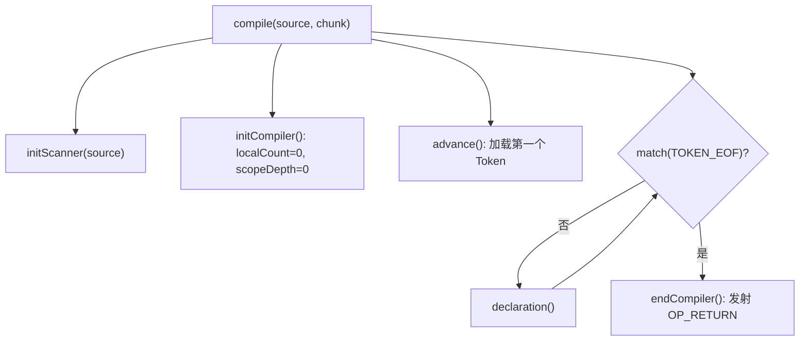

### 逐语句编译

#### 语句 1：`var a = 1;`（全局作用域，scopeDepth=0）

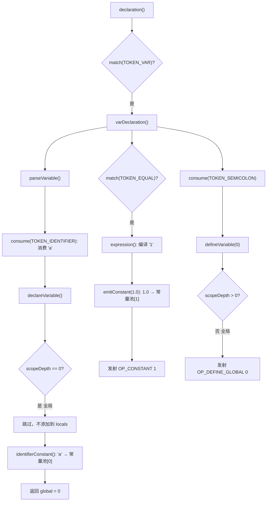

生成字节码：`OP_CONSTANT 1`, `OP_DEFINE_GLOBAL 0`

#### 语句 2：`{` 进入块作用域

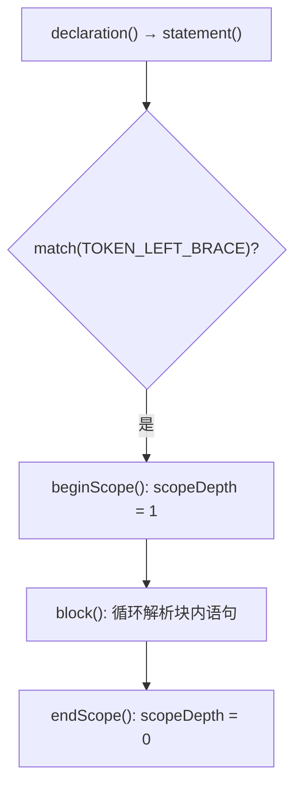

#### 语句 2a：`var a = 2;`（块作用域，scopeDepth=1）

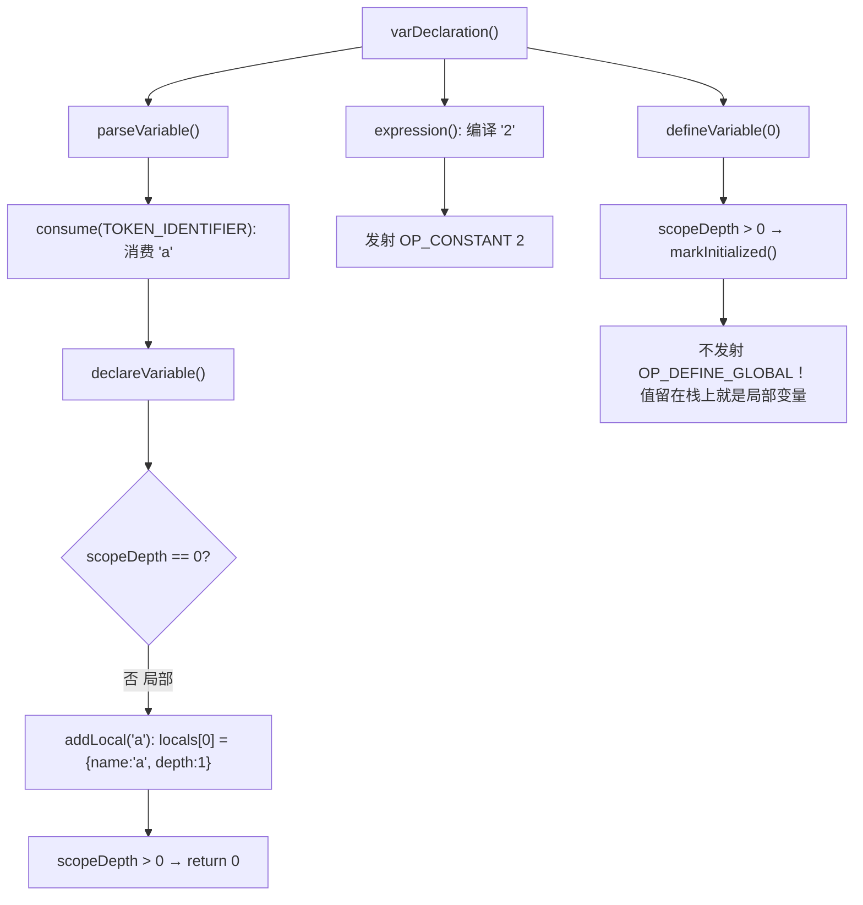

**关键**：局部变量**不需要**发射 `OP_DEFINE_GLOBAL`。`OP_CONSTANT 2` 把 `2.0` 压入栈顶，这个栈位置本身就代表了局部变量 `a`。

#### 语句 2b：`var b = 3;`（块作用域，scopeDepth=1）

同理：`addLocal('b')` → `locals[1] = {name:'b', depth:1}`，发射 `OP_CONSTANT 3`，值留在栈上。

#### 语句 2c：`print a;`

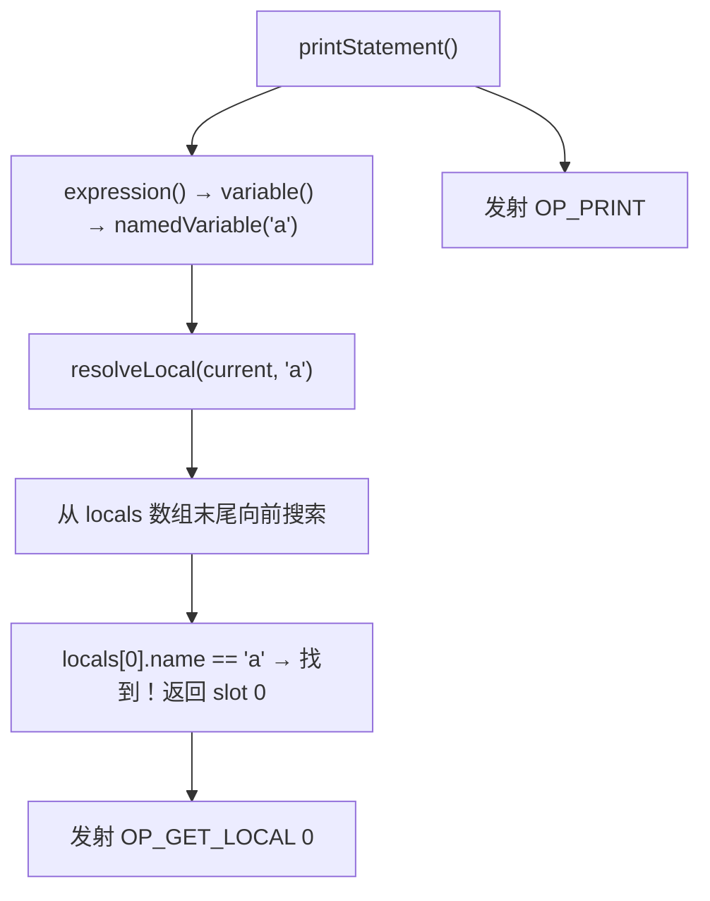

`resolveLocal` 先在局部变量中查找，找到了 `locals[0]`（局部 `a=2`），**遮蔽**了全局的 `a=1`。

#### 语句 2d：`print b;`

同理：`resolveLocal` 找到 `locals[1]`（`b=3`），发射 `OP_GET_LOCAL 1`, `OP_PRINT`。

#### 语句 2e：`}` 离开块作用域

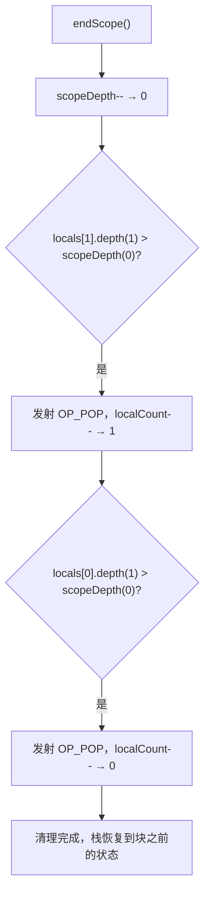

#### 编译结束

`endCompiler()` 发射 `OP_RETURN`。

---

### 编译结果

#### 常量池

| 索引 | 值 | 说明 |
|------|------|------|
| 0 | `"a"` | 全局变量名 |
| 1 | `1.0` | 全局 a 的初始值 |
| 2 | `2.0` | 局部 a 的初始值 |
| 3 | `3.0` | 局部 b 的初始值 |

#### 字节码

| 偏移 | 指令 | 操作数 | 说明 |
|------|------|--------|------|
| 0 | `OP_CONSTANT` | 1 | 压入 1.0 |
| 2 | `OP_DEFINE_GLOBAL` | 0 | 弹出栈顶，定义全局变量 `"a"` = 1.0 |
| 4 | `OP_CONSTANT` | 2 | 压入 2.0（局部变量 a，占据 stack[0]） |
| 6 | `OP_CONSTANT` | 3 | 压入 3.0（局部变量 b，占据 stack[1]） |
| 8 | `OP_GET_LOCAL` | 0 | 读取 stack[0] = 2.0，压入栈顶 |
| 10 | `OP_PRINT` | — | 弹出并打印 2.0 |
| 11 | `OP_GET_LOCAL` | 1 | 读取 stack[1] = 3.0，压入栈顶 |
| 13 | `OP_PRINT` | — | 弹出并打印 3.0 |
| 14 | `OP_POP` | — | 弹出局部变量 b |
| 15 | `OP_POP` | — | 弹出局部变量 a |
| 16 | `OP_RETURN` | — | 程序结束 |

---

## 阶段四：VM 执行（vm.c）

### 执行流程

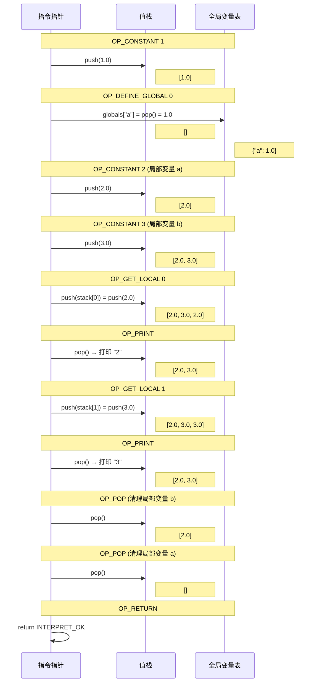

### 逐指令栈状态追踪

```
指令                      | 操作                           | 栈状态               | 全局变量表
========================= | ============================== | ==================== | ==========
OP_CONSTANT 1             | push(1.0)                      | [ 1.0 ]              | {}
OP_DEFINE_GLOBAL 0        | globals["a"] = pop()           | [ ]                  | {"a": 1.0}
OP_CONSTANT 2             | push(2.0)  ← 局部 a           | [ 2.0 ]              | {"a": 1.0}
OP_CONSTANT 3             | push(3.0)  ← 局部 b           | [ 2.0, 3.0 ]         | {"a": 1.0}
OP_GET_LOCAL 0            | push(stack[0]=2.0)             | [ 2.0, 3.0, 2.0 ]    | {"a": 1.0}
OP_PRINT                  | pop() → 输出 "2"              | [ 2.0, 3.0 ]         | {"a": 1.0}
OP_GET_LOCAL 1            | push(stack[1]=3.0)             | [ 2.0, 3.0, 3.0 ]    | {"a": 1.0}
OP_PRINT                  | pop() → 输出 "3"              | [ 2.0, 3.0 ]         | {"a": 1.0}
OP_POP                    | pop() → 丢弃 3.0              | [ 2.0 ]              | {"a": 1.0}
OP_POP                    | pop() → 丢弃 2.0              | [ ]                  | {"a": 1.0}
OP_RETURN                 | return INTERPRET_OK            | [ ]                  | {"a": 1.0}
```

---

## 核心机制总结

### 全局变量 vs 局部变量

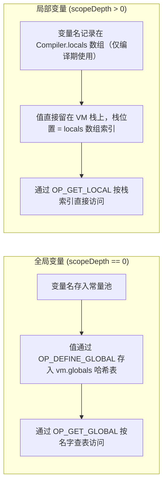

| 特性 | 全局变量 | 局部变量 |
|------|---------|---------|
| 存储位置 | `vm.globals` 哈希表 | VM 栈上 |
| 访问方式 | 按名字查哈希表 | 按栈索引直接读取 |
| 运行时开销 | 哈希 + 探测 | 一次数组下标 |
| 生命周期 | 整个程序 | `endScope` 时 `OP_POP` 清理 |
| 编译期记录 | 变量名存入常量池 | `locals[]` 数组（运行时不存在） |

### 变量遮蔽（Shadowing）

```
全局作用域 (scopeDepth=0):
  vm.globals["a"] = 1.0      ← 通过哈希表存储

块作用域 (scopeDepth=1):
  locals[0] = {name:"a", depth:1}  →  stack[0] = 2.0
  locals[1] = {name:"b", depth:1}  →  stack[1] = 3.0
```

当 `print a;` 执行时，`resolveLocal()` 从 `locals` 数组末尾向前搜索，先找到局部的 `a`（slot 0），返回 `OP_GET_LOCAL 0`。全局的 `a` 被**遮蔽**，根本不会去查 `vm.globals`。

### 块作用域生命周期

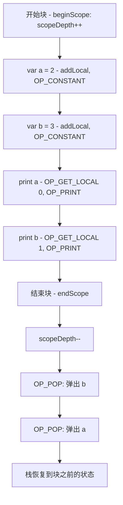
