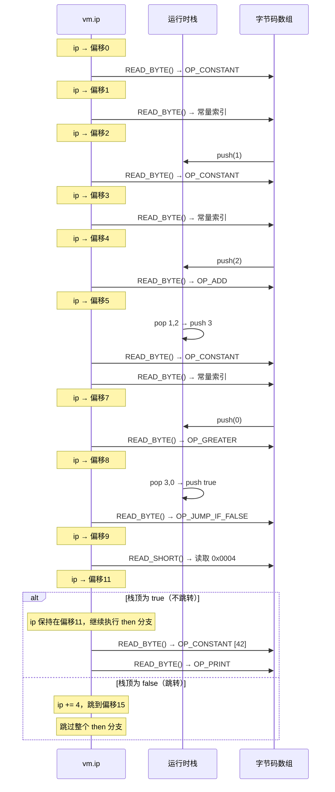

# `ip`（Instruction Pointer）全流程分析

以 `if (1 + 2 > 0) print 42;` 为例，从编译到执行完整追踪 `ip` 的生命周期。

---

## 1. 定义

`ip` 定义在 VM 结构体中（`vm.h:18`）：

```c
typedef struct {
    Chunk *chunk;
    uint8_t *ip;   // 指向字节码数组中【下一条】要执行的指令
    Value stack[STACK_MAX];
    Value *stackTop;
    // ...
} VM;
```

它是一个 `uint8_t*` 指针，直接指向字节码数组（`chunk->code`）中的某个位置。

---

## 2. 编译阶段：生成字节码

编译器将源码编译成以下字节码（简化）：

| 偏移 | 字节码 | 含义 |
|------|--------|------|
| 0 | `OP_CONSTANT [1]` | 压入常量 1 |
| 2 | `OP_CONSTANT [2]` | 压入常量 2 |
| 4 | `OP_ADD` | 1 + 2 = 3 |
| 5 | `OP_CONSTANT [0]` | 压入常量 0 |
| 7 | `OP_GREATER` | 3 > 0 = true |
| 8 | `OP_JUMP_IF_FALSE` | 条件跳转 |
| 9 | `0x00` | 跳转偏移高字节 |
| 10 | `0x04` | 跳转偏移低字节（共4字节） |
| 11 | `OP_CONSTANT [42]` | 压入 42 |
| 13 | `OP_PRINT` | 打印 |
| 14 | ... | 继续执行 |

其中偏移 9-10 的跳转距离是由 **backpatching** 回填的：

```c
// compiler.c:206 — 先写占位符
static int emitJump(uint8_t instruction) {
    emitByte(instruction);
    emitByte(0xff);  // 占位
    emitByte(0xff);  // 占位
    return currentChunk()->count - 2; // 返回占位符位置
}

// compiler.c:248 — 后回填实际距离
static void patchJump(int offset) {
    int jump = currentChunk()->count - offset - 2;
    currentChunk()->code[offset]     = (jump >> 8) & 0xff; // 高字节
    currentChunk()->code[offset + 1] = jump & 0xff;        // 低字节
}
```

---

## 3. 初始化：ip 指向字节码起点

```c
// vm.c:333
vm.ip = vm.chunk->code;  // ip → 偏移 0
```

---

## 4. 执行阶段：ip 的移动

`run()` 函数中的核心宏（`vm.c:110-113`）：

```c
#define READ_BYTE()     (*vm.ip++)          // 读1字节，ip前进1
#define READ_SHORT()    (vm.ip += 2, \      // ip前进2
    (uint16_t)((vm.ip[-2] << 8) | vm.ip[-1])) // 组合成16位值
#define READ_CONSTANT() (vm.chunk->constants.values[READ_BYTE()])
```

### 逐步执行流程



---

## 5. 跳转指令中 ip 的关键变化

```c
// vm.c:300-306
case OP_JUMP_IF_FALSE: {
    uint16_t offset = READ_SHORT(); // ① ip 已前进2字节（跳过偏移量本身）
    if (isFalsey(peek(0)))
        vm.ip += offset;            // ② 条件为假时，ip 再前进 offset 字节
    break;
}
```

用内存图表示：

```
字节码数组:
  [8]    [9]    [10]   [11]   [12]   [13]   [14]
  JUMP   0x00   0x04   CONST  idx    PRINT  ...
  IF_F
         ↑ ip (READ_SHORT前)
                        ↑ ip (READ_SHORT后)

  如果 false: ip += 4 → ip 指向 [14]，跳过 [11][12][13]
  如果 true:  ip 不变 → ip 指向 [11]，执行 then 分支
```

---

## 6. 错误报告中的 ip

```c
// vm.c:39
size_t instruction = vm.ip - vm.chunk->code - 1;
```

因为 `ip` 始终指向**下一条**指令，所以 `-1` 才能定位到**当前出错的**指令偏移，再通过 `chunk->lines[instruction]` 查到源码行号。

---

## 总结

| 阶段 | ip 的状态 | 关键代码位置 |
|------|----------|------------|
| 定义 | `uint8_t*` 字段 | `vm.h:18` |
| 初始化 | 指向 `chunk->code` 起始 | `vm.c:333` |
| 逐条执行 | `READ_BYTE()` 后移 1 字节 | `vm.c:110, 172` |
| 读取操作数 | `READ_SHORT()` 后移 2 字节 | `vm.c:112-113` |
| 条件跳转 | `ip += offset` 前跳 | `vm.c:304` |
| 编译期占位 | `emitJump` 写 `0xff` 占位 | `compiler.c:212-213` |
| 编译期回填 | `patchJump` 写入真实偏移 | `compiler.c:264-265` |
| 错误定位 | `ip - code - 1` 回退到当前指令 | `vm.c:39` |
