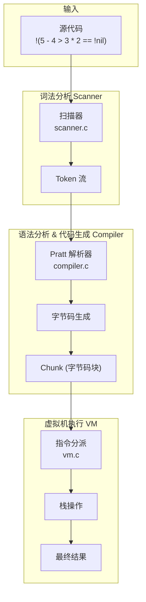
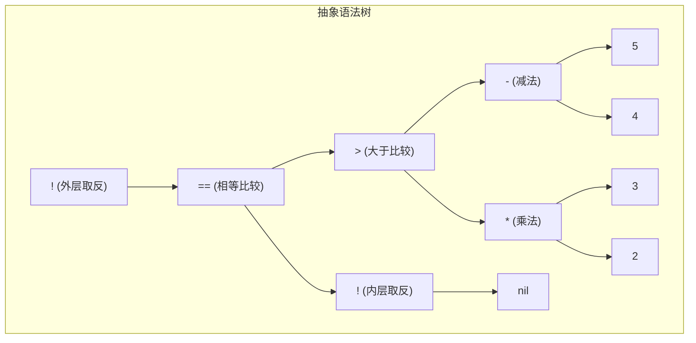
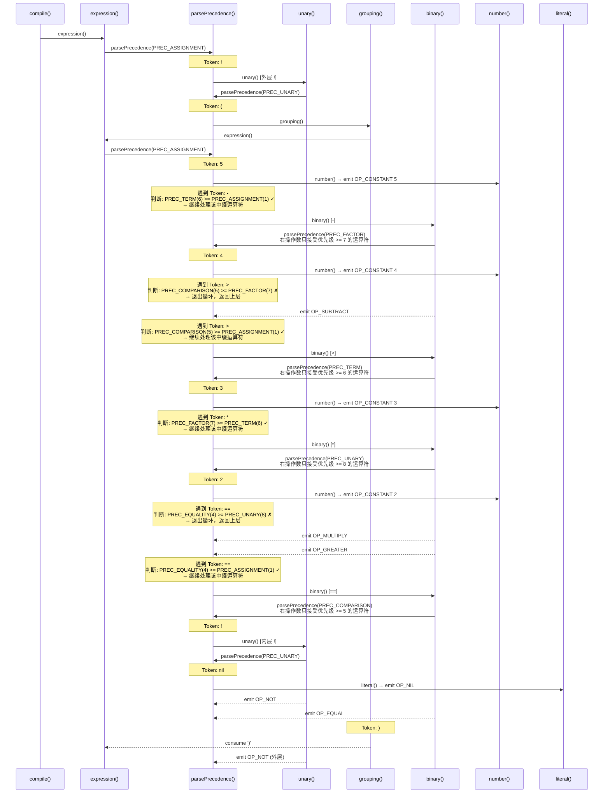
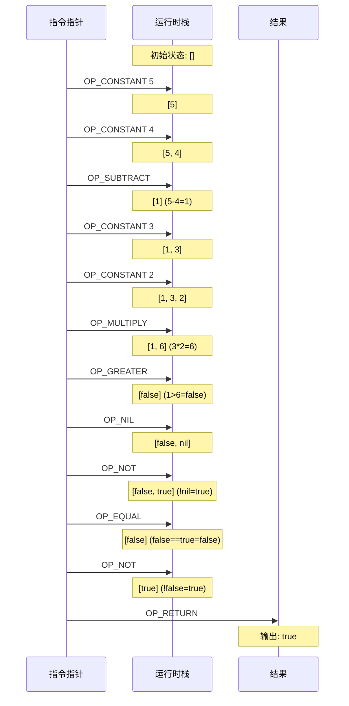
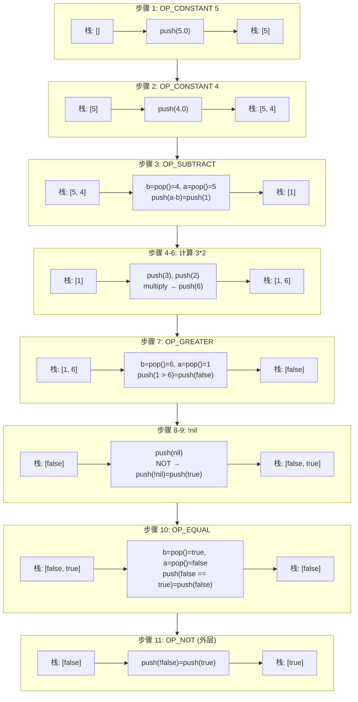
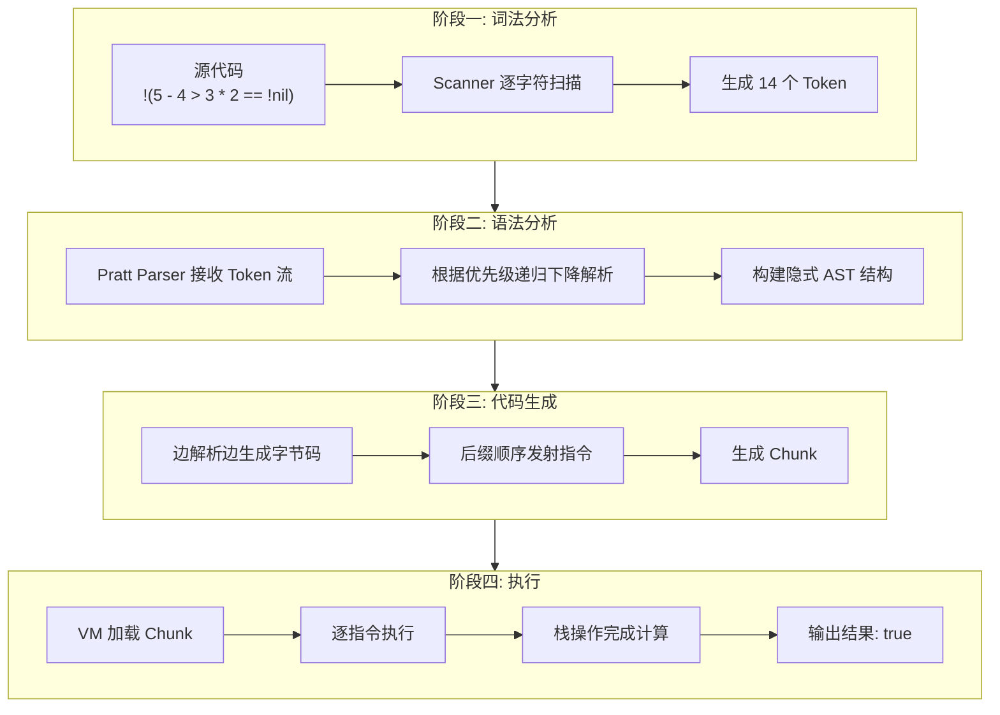

# 表达式解析全流程分析

## 表达式: `!(5 - 4 > 3 * 2 == !nil)`

本文档详细分析该表达式在 clox 编译器中从源代码到字节码执行的完整流程。

---

## 一、整体架构概览



---

## 二、词法分析阶段 (Lexical Analysis)

### 2.1 Scanner 工作原理

Scanner 逐字符扫描源代码，将字符流转换为 Token 流。

```mermaid
flowchart LR
    subgraph Source["源代码字符流"]
        S1["!"] --> S2["("]
        S2 --> S3["5"]
        S3 --> S4[" "]
        S4 --> S5["-"]
        S5 --> S6[" "]
        S6 --> S7["4"]
        S7 --> S8[" "]
        S8 --> S9[">"]
        S9 --> S10[" "]
        S10 --> S11["3"]
        S11 --> S12[" "]
        S12 --> S13["*"]
        S13 --> S14[" "]
        S14 --> S15["2"]
        S15 --> S16[" "]
        S16 --> S17["="]
        S17 --> S18["="]
        S18 --> S19[" "]
        S19 --> S20["!"]
        S20 --> S21["n"]
        S21 --> S22["i"]
        S22 --> S23["l"]
        S23 --> S24[")"]
    end
```



### 2.2 Token 生成序列

| 序号 | Token | TokenType | 源码位置 |
|------|-------|-----------|----------|
| 1 | `!` | `TOKEN_BANG` | 0 |
| 2 | `(` | `TOKEN_LEFT_PAREN` | 1 |
| 3 | `5` | `TOKEN_NUMBER` | 2 |
| 4 | `-` | `TOKEN_MINUS` | 4 |
| 5 | `4` | `TOKEN_NUMBER` | 6 |
| 6 | `>` | `TOKEN_GREATER` | 8 |
| 7 | `3` | `TOKEN_NUMBER` | 10 |
| 8 | `*` | `TOKEN_STAR` | 12 |
| 9 | `2` | `TOKEN_NUMBER` | 14 |
| 10 | `==` | `TOKEN_EQUAL_EQUAL` | 16 |
| 11 | `!` | `TOKEN_BANG` | 19 |
| 12 | `nil` | `TOKEN_NIL` | 20 |
| 13 | `)` | `TOKEN_RIGHT_PAREN` | 23 |
| 14 | `EOF` | `TOKEN_EOF` | 24 |

### 2.3 关键扫描代码

```c
// scanner.c - scanToken() 函数核心逻辑
Token scanToken() {
    skipWhitespace();           // 跳过空白
    scanner.start = scanner.current;
    
    if (isAtEnd()) return makeToken(TOKEN_EOF);
    
    char c = advance();
    if (isAlpha(c)) return identifier();  // 识别标识符/关键字
    if (isDigit(c)) return number();      // 识别数字
    
    switch (c) {
        case '!': return makeToken(match('=') ? TOKEN_BANG_EQUAL : TOKEN_BANG);
        case '=': return makeToken(match('=') ? TOKEN_EQUAL_EQUAL : TOKEN_EQUAL);
        // ... 其他单字符 token
    }
}
```

---

## 三、语法分析阶段 (Syntax Analysis)

### 3.1 运算符优先级表

本编译器使用 **Pratt Parser（普拉特解析器）**，核心是优先级驱动的解析。

```mermaid
graph TB
    subgraph Precedence["优先级从低到高"]
        P1["PREC_NONE (0)"]
        P2["PREC_ASSIGNMENT (1) ="]
        P3["PREC_OR (2) or"]
        P4["PREC_AND (3) and"]
        P5["PREC_EQUALITY (4) == !="]
        P6["PREC_COMPARISON (5) < > <= >="]
        P7["PREC_TERM (6) + -"]
        P8["PREC_FACTOR (7) * /"]
        P9["PREC_UNARY (8) ! -"]
        P10["PREC_CALL (9) . ()"]
        P11["PREC_PRIMARY (10)"]
    end
    
    P1 --> P2 --> P3 --> P4 --> P5 --> P6 --> P7 --> P8 --> P9 --> P10 --> P11
```



### 3.2 ParseRule 解析规则表（相关部分）

| TokenType | prefix (前缀) | infix (中缀) | precedence (优先级) |
|-----------|---------------|--------------|---------------------|
| `TOKEN_BANG` | `unary` | NULL | PREC_NONE |
| `TOKEN_LEFT_PAREN` | `grouping` | NULL | PREC_NONE |
| `TOKEN_NUMBER` | `number` | NULL | PREC_NONE |
| `TOKEN_MINUS` | `unary` | `binary` | PREC_TERM |
| `TOKEN_STAR` | NULL | `binary` | PREC_FACTOR |
| `TOKEN_GREATER` | NULL | `binary` | PREC_COMPARISON |
| `TOKEN_EQUAL_EQUAL` | NULL | `binary` | PREC_EQUALITY |
| `TOKEN_NIL` | `literal` | NULL | PREC_NONE |

### 3.3 抽象语法树 (AST) 结构



---

## 四、Pratt Parser 解析详细过程

### 4.1 解析流程状态图

```mermaid
stateDiagram-v2
    [*] --> Start: 开始解析
    
    Start --> ParseBang: advance() 获取 !
    ParseBang --> UnaryOuter: unary() 处理外层 !
    
    UnaryOuter --> ParseLeftParen: advance() 获取 (
    ParseLeftParen --> Grouping: grouping() 处理括号
    
    Grouping --> ParseExpression: expression() 解析括号内表达式
    
    ParseExpression --> Parse5: 解析 5
    Parse5 --> ParseMinus: 遇到 - (PREC_TERM)
    ParseMinus --> Parse4: 解析 4
    Parse4 --> SubComplete: 完成 5-4
    
    SubComplete --> ParseGreater: 遇到 > (PREC_COMPARISON)
    ParseGreater --> Parse3: 解析 3
    Parse3 --> ParseStar: 遇到 * (PREC_FACTOR > PREC_COMPARISON+1)
    ParseStar --> Parse2: 解析 2
    Parse2 --> MulComplete: 完成 3*2
    MulComplete --> GreaterComplete: 完成 5-4 > 3*2
    
    GreaterComplete --> ParseEqualEqual: 遇到 == (PREC_EQUALITY)
    ParseEqualEqual --> ParseBangInner: 解析 !nil
    ParseBangInner --> ParseNil: 解析 nil
    ParseNil --> NotComplete: 完成 !nil
    NotComplete --> EqualComplete: 完成 == 比较
    
    EqualComplete --> ParseRightParen: 遇到 )
    ParseRightParen --> GroupingComplete: grouping() 完成
    GroupingComplete --> OuterNotComplete: 外层 ! 完成
    
    OuterNotComplete --> [*]: 解析结束
```



### 4.2 详细递归调用栈

> **🔑 优先级判断规则理解指南**
> 
> 在 Pratt Parser 的 `parsePrecedence(minPrec)` 循环中：
> ```c
> while (minPrec <= getRule(parser.current.type)->precedence) { ... }
> ```
> 
> - **`minPrec`**: 当前调用允许的**最低优先级**（传入参数）
> - **`getRule(...)->precedence`**: 当前 token 作为**中缀运算符的优先级**
> - **判断**: 如果 `当前token优先级 >= minPrec`，则**继续处理**该运算符；否则**退出循环**返回上层
> 
> 这决定了"这个运算符归谁管"——高优先级运算符会被内层递归"抢走"。



### 4.3 核心解析代码解析

```c
// compiler.c - parsePrecedence() 核心算法
static void parsePrecedence(Precedence precedence) {
    advance();  // 获取下一个 token
    
    // 1. 前缀处理：获取前缀解析函数
    ParseFn prefixRule = getRule(parser.previous.type)->prefix;
    if (prefixRule == NULL) {
        error("Expect expression.");
        return;
    }
    prefixRule();  // 调用前缀函数（如 number, unary, grouping）
    
    // 2. 中缀处理：循环处理中缀运算符
    // 关键：只有当前 token 的优先级 >= 传入的优先级时才继续
    while (precedence <= getRule(parser.current.type)->precedence) {
        advance();
        ParseFn infixRule = getRule(parser.previous.type)->infix;
        infixRule();  // 调用中缀函数（如 binary）
    }
}

// unary() - 一元运算符处理
static void unary() {
    TokenType operatorType = parser.previous.type;
    
    // 递归解析操作数，使用 PREC_UNARY 优先级
    // 这允许嵌套一元表达式如 !!value
    parsePrecedence(PREC_UNARY);
    
    switch (operatorType) {
        case TOKEN_BANG:  emitByte(OP_NOT);    break;
        case TOKEN_MINUS: emitByte(OP_NEGATE); break;
    }
}

// binary() - 二元运算符处理
static void binary() {
    TokenType operatorType = parser.previous.type;
    ParseRule *rule = getRule(operatorType);
    
    // 关键：使用 precedence + 1 实现左结合性
    // 右操作数只能包含更高优先级的表达式
    parsePrecedence((Precedence)(rule->precedence + 1));
    
    // 发射对应的操作码
    switch (operatorType) {
        case TOKEN_EQUAL_EQUAL: emitByte(OP_EQUAL);    break;
        case TOKEN_GREATER:     emitByte(OP_GREATER);  break;
        case TOKEN_MINUS:       emitByte(OP_SUBTRACT); break;
        case TOKEN_STAR:        emitByte(OP_MULTIPLY); break;
        // ...
    }
}
```

---

## 五、字节码生成

### 5.1 生成的字节码序列

```mermaid
flowchart TB
    subgraph Bytecode["字节码序列"]
        B0["0: OP_CONSTANT 0 (5.0)"]
        B1["2: OP_CONSTANT 1 (4.0)"]
        B2["4: OP_SUBTRACT"]
        B3["5: OP_CONSTANT 2 (3.0)"]
        B4["7: OP_CONSTANT 3 (2.0)"]
        B5["9: OP_MULTIPLY"]
        B6["10: OP_GREATER"]
        B7["11: OP_NIL"]
        B8["12: OP_NOT"]
        B9["13: OP_EQUAL"]
        B10["14: OP_NOT"]
        B11["15: OP_RETURN"]
    end
    
    B0 --> B1 --> B2 --> B3 --> B4 --> B5 --> B6 --> B7 --> B8 --> B9 --> B10 --> B11
```



### 5.2 字节码详细说明

| 偏移 | 操作码 | 操作数 | 说明 |
|------|--------|--------|------|
| 0 | `OP_CONSTANT` | 0 | 压入常量 5.0 |
| 2 | `OP_CONSTANT` | 1 | 压入常量 4.0 |
| 4 | `OP_SUBTRACT` | - | 计算 5 - 4 = 1 |
| 5 | `OP_CONSTANT` | 2 | 压入常量 3.0 |
| 7 | `OP_CONSTANT` | 3 | 压入常量 2.0 |
| 9 | `OP_MULTIPLY` | - | 计算 3 * 2 = 6 |
| 10 | `OP_GREATER` | - | 计算 1 > 6 = false |
| 11 | `OP_NIL` | - | 压入 nil |
| 12 | `OP_NOT` | - | 计算 !nil = true |
| 13 | `OP_EQUAL` | - | 计算 false == true = false |
| 14 | `OP_NOT` | - | 计算 !false = true |
| 15 | `OP_RETURN` | - | 返回结果 |

### 5.3 常量池

| 索引 | 值 | 类型 |
|------|-----|------|
| 0 | 5.0 | NUMBER |
| 1 | 4.0 | NUMBER |
| 2 | 3.0 | NUMBER |
| 3 | 2.0 | NUMBER |

---

## 六、虚拟机执行阶段

### 6.1 栈操作过程



### 6.2 逐步执行详解



### 6.3 关键 VM 代码

```c
// vm.c - run() 函数核心指令处理
static InterpretResult run() {
    for (;;) {
        uint8_t instruction;
        switch (instruction = READ_BYTE()) {
            case OP_CONSTANT: {
                Value constant = READ_CONSTANT();
                push(constant);
                break;
            }
            case OP_NIL:
                push(NIL_VAL);
                break;
            case OP_EQUAL: {
                Value b = pop();
                Value a = pop();
                push(BOOL_VAL(valuesEqual(a, b)));
                break;
            }
            case OP_GREATER:
                BINARY_OP(BOOL_VAL, >);  // 宏展开执行比较
                break;
            case OP_SUBTRACT:
                BINARY_OP(NUMBER_VAL, -);
                break;
            case OP_MULTIPLY:
                BINARY_OP(NUMBER_VAL, *);
                break;
            case OP_NOT:
                push(BOOL_VAL(isFalsey(pop())));
                break;
            case OP_RETURN: {
                printValue(pop());
                return INTERPRET_OK;
            }
        }
    }
}

// isFalsey() - 判断值的"假"性
static bool isFalsey(Value value) {
    return IS_NIL(value) || (IS_BOOL(value) && !AS_BOOL(value));
}
```

---

## 七、完整流程总结



### 最终计算过程

```
表达式: !(5 - 4 > 3 * 2 == !nil)

计算步骤:
1. 5 - 4 = 1
2. 3 * 2 = 6
3. 1 > 6 = false
4. !nil = true
5. false == true = false
6. !false = true

最终结果: true
```

---

## 八、关键设计亮点

### 8.1 单遍编译

本编译器采用**单遍编译**（Single-Pass Compilation）设计：
- 词法分析、语法分析、代码生成在一次遍历中完成
- 没有显式构建 AST，边解析边生成字节码
- 内存效率高，适合资源受限环境

### 8.2 Pratt Parser 优势

1. **表驱动**: `ParseRule` 数组将 token 类型映射到解析函数和优先级
2. **优雅处理优先级**: 通过 `precedence + 1` 自然实现左结合
3. **易于扩展**: 新增运算符只需更新规则表

### 8.3 基于栈的虚拟机

- 操作数和结果都在栈上操作
- 指令简洁，易于实现
- 后缀表达式天然适合栈计算

---

## 附录：值类型系统

```c
// value.h - 值的标记联合体表示
typedef enum {
    VAL_BOOL,    // 布尔值
    VAL_NIL,     // 空值
    VAL_NUMBER,  // 数字
} ValueType;

typedef struct {
    ValueType type;
    union {
        bool boolean;
        double number;
    } as;
} Value;
```

这种设计允许动态类型检查和类型安全的值操作。
