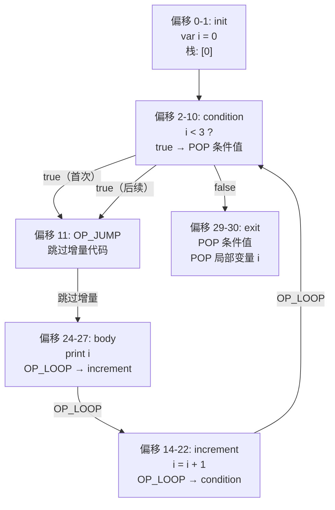
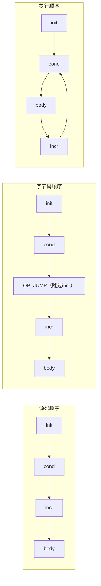

# for 循环编译全流程分析

以 `for (var i = 0; i < 3; i = i + 1) { print i; }` 为例，完整分析 `forStatement()` 的编译过程和运行时行为。

---

## 源码结构

```
for ( var i = 0 ;  i < 3 ;  i = i + 1 ) { print i; }
      ─────────  ───────  ───────────   ───────────
       初始化      条件      增量           循环体
```

---

## 编译期：forStatement() 逐段分析

### 第一步：初始化子句 `var i = 0`

```c
beginScope();  // for 循环开启新作用域，变量 i 限制在循环内
consume(TOKEN_LEFT_PAREN, ...);  // 消费 '('

// 匹配到 TOKEN_VAR，走 varDeclaration() 分支
else if (match(TOKEN_VAR))
{
    varDeclaration();  // 编译 var i = 0;
}
```

生成字节码：

```
偏移 0: OP_CONSTANT [0]     ← 压入数字 0
偏移 2: OP_DEFINE_LOCAL      ← 定义局部变量 i（实际上局部变量就留在栈上）
```

### 第二步：条件子句 `i < 3`

```c
int loopStart = currentChunk()->count;  // 记录条件判断起始位置（偏移 2）
int exitJump = -1;

// 没有匹配到分号，说明有条件表达式
if (!match(TOKEN_SEMICOLON))
{
    expression();           // 编译 i < 3
    consume(TOKEN_SEMICOLON, ...);
    exitJump = emitJump(OP_JUMP_IF_FALSE);  // 条件为 false 则退出循环
    emitByte(OP_POP);       // true 路径：弹出条件值
}
```

生成字节码：

```
偏移 2: OP_GET_LOCAL [i]              ← 压入 i 的值     ← loopStart 指向这里
偏移 4: OP_CONSTANT [3]              ← 压入数字 3
偏移 6: OP_LESS                      ← i < 3 ?
偏移 7: OP_JUMP_IF_FALSE [→ exit]    ← false 则跳到循环末尾
偏移 10: OP_POP                       ← true 路径弹出条件值
```

### 第三步：增量子句 `i = i + 1`

```c
// 没有匹配到右括号，说明有增量表达式
if (!match(TOKEN_RIGHT_PAREN))
{
    int bodyJump = emitJump(OP_JUMP);          // 跳过增量，先执行循环体
    int incrementStart = currentChunk()->count; // 记录增量代码起始位置
    expression();                               // 编译 i = i + 1
    emitByte(OP_POP);                           // 增量表达式的值没用，弹掉
    consume(TOKEN_RIGHT_PAREN, ...);            // 消费 ')'

    emitLoop(loopStart);       // 增量执行完 → 跳回条件判断（此时 loopStart 还指向条件）
    loopStart = incrementStart; // 关键：将 loopStart 改为指向增量代码
    patchJump(bodyJump);        // 回填跳转，让 bodyJump 跳到循环体
}
```

生成字节码：

```
偏移 11: OP_JUMP [→ body]             ← bodyJump：跳过增量去循环体
偏移 14: OP_GET_LOCAL [i]             ← incrementStart 指向这里
偏移 16: OP_CONSTANT [1]             ← 压入数字 1
偏移 18: OP_ADD                       ← i + 1
偏移 19: OP_SET_LOCAL [i]            ← i = i + 1
偏移 21: OP_POP                       ← 弹掉赋值表达式的值
偏移 22: OP_LOOP [→ 偏移 2]           ← 跳回条件判断
         （此时 loopStart 被改为 14，即增量代码起始位置）
```

### 第四步：循环体 `{ print i; }`

```c
statement();           // 编译循环体
emitLoop(loopStart);   // 循环体结束 → 跳回增量代码（loopStart 已改为 incrementStart）
```

生成字节码：

```
偏移 24: OP_GET_LOCAL [i]             ← bodyJump 跳到这里（循环体开始）
偏移 26: OP_PRINT                     ← 打印 i
偏移 27: OP_LOOP [→ 偏移 14]          ← 跳回增量代码
```

### 第五步：退出处理

```c
if (exitJump != -1)
{
    patchJump(exitJump);  // 回填 JUMP_IF_FALSE 的跳转目标到这里
    emitByte(OP_POP);     // false 路径：弹出条件值
}
endScope();               // 结束作用域，弹出局部变量 i
```

生成字节码：

```
偏移 29: OP_POP                       ← false 路径弹出条件值（exitJump 跳到这里）
偏移 30: OP_POP                       ← endScope：弹出局部变量 i
```

---

## 完整字节码布局

```
偏移     字节码                      说明
─────────────────────────────────────────────────────
 0       OP_CONSTANT [0]            init: 压入 0
 2       OP_GET_LOCAL [i]           condition: 取 i     ← loopStart（原始）
 4       OP_CONSTANT [3]            压入 3
 6       OP_LESS                    i < 3 ?
 7       OP_JUMP_IF_FALSE [→29]     false → 退出
10       OP_POP                     true 路径弹条件值
11       OP_JUMP [→24]              bodyJump: 跳过增量
14       OP_GET_LOCAL [i]           increment: 取 i     ← incrementStart（新 loopStart）
16       OP_CONSTANT [1]            压入 1
18       OP_ADD                     i + 1
19       OP_SET_LOCAL [i]           i = i + 1
21       OP_POP                     弹掉赋值结果
22       OP_LOOP [→2]              跳回 condition
24       OP_GET_LOCAL [i]           body: 取 i          ← bodyJump 目标
26       OP_PRINT                   打印 i
27       OP_LOOP [→14]             跳回 increment
29       OP_POP                     false 路径弹条件值   ← exitJump 目标
30       OP_POP                     弹出局部变量 i
```

---

## 运行时执行流程

### 跳转关系图



### 逐次迭代追踪

#### 第 1 次迭代（i = 0）

```
偏移 0:  OP_CONSTANT 0              栈: [ 0 ]         ← i = 0
偏移 2:  OP_GET_LOCAL i             栈: [ 0 ][ 0 ]
偏移 4:  OP_CONSTANT 3              栈: [ 0 ][ 0 ][ 3 ]
偏移 6:  OP_LESS                    栈: [ 0 ][ true ]    0 < 3 = true
偏移 7:  OP_JUMP_IF_FALSE           peek = true，不跳转
偏移 10: OP_POP                     栈: [ 0 ]            弹掉条件值
偏移 11: OP_JUMP → 偏移 24          跳过增量，去循环体
偏移 24: OP_GET_LOCAL i             栈: [ 0 ][ 0 ]
偏移 26: OP_PRINT                   栈: [ 0 ]            输出: 0
偏移 27: OP_LOOP → 偏移 14          跳到增量
偏移 14: OP_GET_LOCAL i             栈: [ 0 ][ 0 ]
偏移 16: OP_CONSTANT 1              栈: [ 0 ][ 0 ][ 1 ]
偏移 18: OP_ADD                     栈: [ 0 ][ 1 ]
偏移 19: OP_SET_LOCAL i             栈: [ 1 ][ 1 ]       i 变为 1
偏移 21: OP_POP                     栈: [ 1 ]            弹掉赋值结果
偏移 22: OP_LOOP → 偏移 2           跳回条件判断
```

#### 第 2 次迭代（i = 1）

```
偏移 2:  OP_GET_LOCAL i             栈: [ 1 ][ 1 ]
偏移 4:  OP_CONSTANT 3              栈: [ 1 ][ 1 ][ 3 ]
偏移 6:  OP_LESS                    栈: [ 1 ][ true ]    1 < 3 = true
偏移 7:  OP_JUMP_IF_FALSE           不跳转
偏移 10: OP_POP                     栈: [ 1 ]
偏移 11: OP_JUMP → 偏移 24
偏移 24: OP_GET_LOCAL i             栈: [ 1 ][ 1 ]
偏移 26: OP_PRINT                   栈: [ 1 ]            输出: 1
偏移 27: OP_LOOP → 偏移 14
         ... 增量 i = 2 ...
偏移 22: OP_LOOP → 偏移 2
```

#### 第 3 次迭代（i = 2）

```
         ... 同上流程 ...
偏移 26: OP_PRINT                                        输出: 2
         ... 增量 i = 3 ...
偏移 22: OP_LOOP → 偏移 2
```

#### 退出（i = 3）

```
偏移 2:  OP_GET_LOCAL i             栈: [ 3 ][ 3 ]
偏移 4:  OP_CONSTANT 3              栈: [ 3 ][ 3 ][ 3 ]
偏移 6:  OP_LESS                    栈: [ 3 ][ false ]   3 < 3 = false
偏移 7:  OP_JUMP_IF_FALSE → 偏移 29  peek = false，跳转！
偏移 29: OP_POP                     栈: [ 3 ]            弹掉条件值
偏移 30: OP_POP                     栈: [ ]              弹掉局部变量 i
         程序结束，输出了: 0 1 2
```

---

## 两个 emitLoop 的跳转目标对比

| 代码位置 | 跳转目标 | 作用 |
|----------|---------|------|
| 第 983 行 `emitLoop(loopStart)` | 条件判断（偏移 2） | 增量执行完 → 回到条件判断 |
| 第 989 行 `emitLoop(loopStart)` | 增量代码（偏移 14） | 循环体执行完 → 去执行增量 |

第 983 行执行时 `loopStart` 还没被修改，指向条件判断；第 984 行修改后，第 989 行用的就是新的值，指向增量代码。

---

## 为什么增量代码要放在循环体之前

源码中增量写在条件和循环体之间：`for (init; cond; incr) body`

但执行顺序要求是：`init → cond → body → incr → cond → body → incr → ...`

编译器是**单遍**的，按源码顺序读取 token，读到增量时循环体还没出现。所以只能先编译增量，再编译循环体，然后用跳转调换执行顺序：



这就是 `bodyJump = emitJump(OP_JUMP)` 存在的原因——它让字节码中先出现的增量代码在运行时被跳过，等循环体执行完再回来执行。
