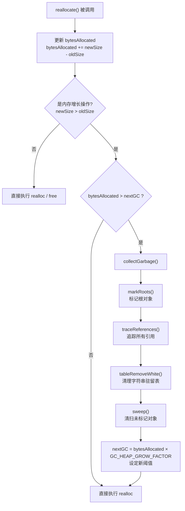
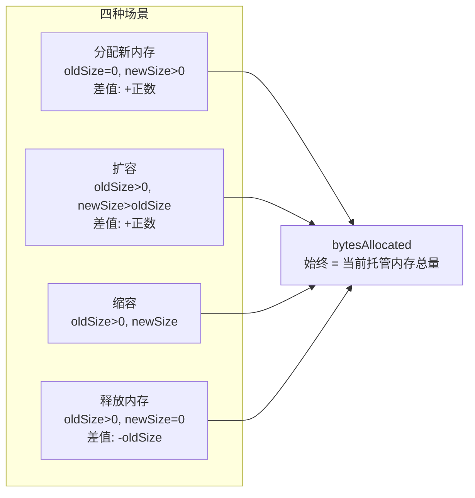
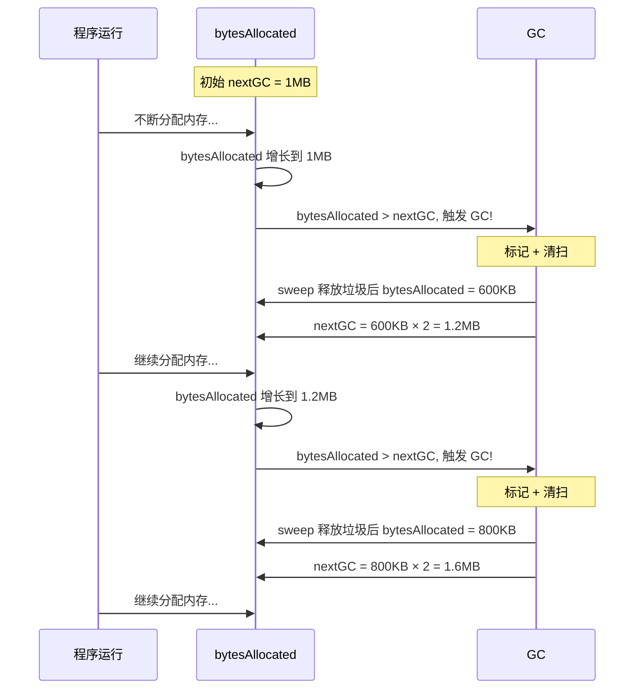
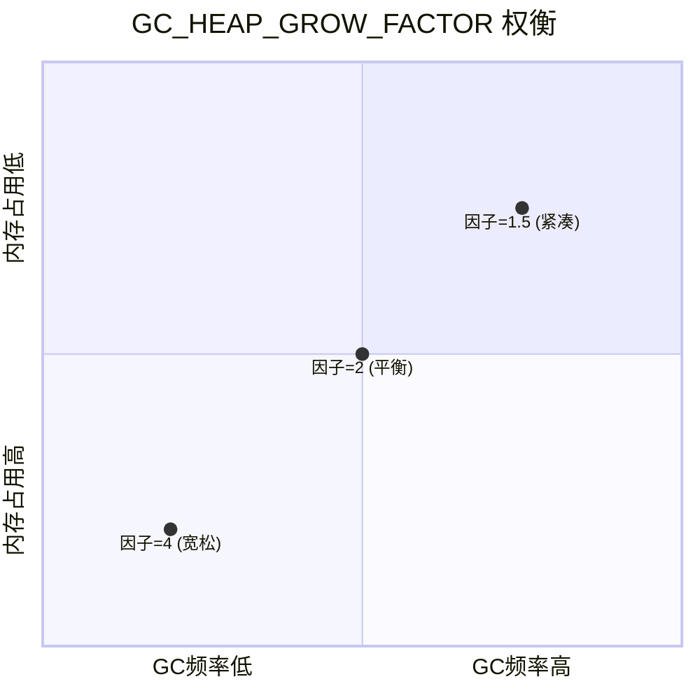
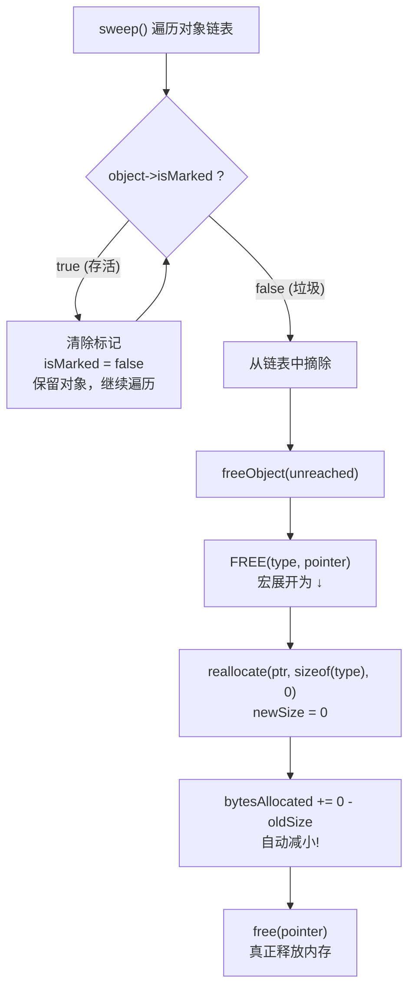
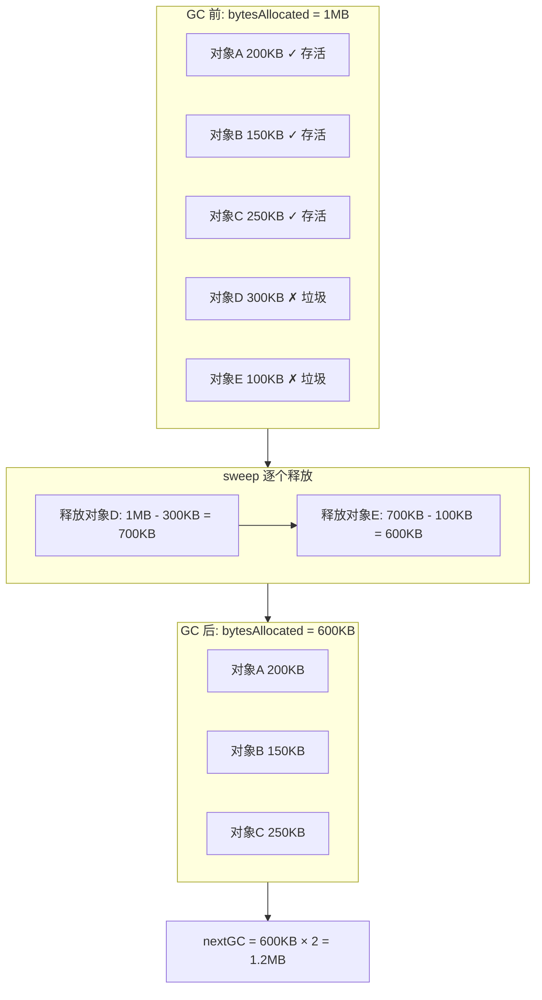
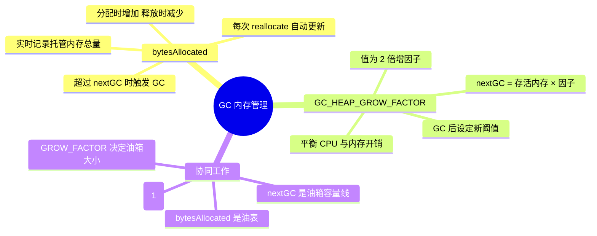

# bytesAllocated 与 GC_HEAP_GROW_FACTOR 详解

## 一、概述

在 clox 虚拟机的垃圾回收（GC）机制中，`bytesAllocated` 和 `GC_HEAP_GROW_FACTOR` 是两个核心变量，它们协同工作，决定了 **何时触发 GC** 以及 **GC 后下一次触发的阈值**。

---

## 二、变量定义

```c
// vm.h - VM 结构体中
typedef struct {
    // ...
    size_t bytesAllocated;  // 虚拟机已分配的托管内存实时字节总数
    size_t nextGC;          // 触发下一次回收的阈值
    // ...
} VM;
```

```c
// memory.c
#define GC_HEAP_GROW_FACTOR 2
```

| 变量 | 类型 | 作用 |
|------|------|------|
| `bytesAllocated` | `size_t` | 实时跟踪 VM 当前托管内存的总字节数（油表） |
| `nextGC` | `size_t` | 触发下一次 GC 的内存阈值（油箱容量线） |
| `GC_HEAP_GROW_FACTOR` | 宏常量 `2` | 每次 GC 后，阈值 = 存活内存 × 此因子 |

---

## 三、整体协作流程



---

## 四、bytesAllocated 详解

### 4.1 记账原理

`reallocate()` 是虚拟机中 **所有内存操作的唯一入口**，其第一行就更新计数：

```c
vm.bytesAllocated += newSize - oldSize;
```

这一行巧妙地覆盖了所有四种内存操作场景：



### 4.2 触发 GC 的判断

```c
if (newSize > oldSize) {              // 只在内存增长时检查
    if (vm.bytesAllocated > vm.nextGC) {  // 超过阈值?
        collectGarbage();                  // 触发 GC
    }
}
```

> 只有 **内存增长** 时才检查，缩容和释放不会触发 GC（因为内存在减少，没必要回收）。

---

## 五、GC_HEAP_GROW_FACTOR 详解

### 5.1 作用

每次 GC 结束后，用存活内存量乘以此因子来设定下一次 GC 的阈值：

```c
vm.nextGC = vm.bytesAllocated * GC_HEAP_GROW_FACTOR;
```

### 5.2 自适应调度示意



### 5.3 因子大小的权衡



| 因子值 | GC 频率 | 内存占用 | 适用场景 |
|--------|---------|----------|----------|
| **1.5**（小） | 高，GC 频繁 | 低，内存紧凑 | 内存受限环境 |
| **2**（当前值） | 适中 | 适中 | 通用平衡选择 |
| **4**（大） | 低，GC 很少 | 高，允许大量积累 | CPU 敏感、内存充裕 |

> 选择 **2** 的原因：与动态数组倍增策略一致，保证 GC 的摊还成本为 O(1)。

---

## 六、sweep 如何让 bytesAllocated 减小

sweep 并不直接修改 `bytesAllocated`，而是通过调用链间接完成：



### 具体数字示例



---

## 七、总结



> **一句话总结**：`bytesAllocated` 是"油表"（告诉你用了多少内存），`GC_HEAP_GROW_FACTOR` 决定"油箱容量"（用到多满才去清理），两者配合实现了自适应的垃圾回收调度。
