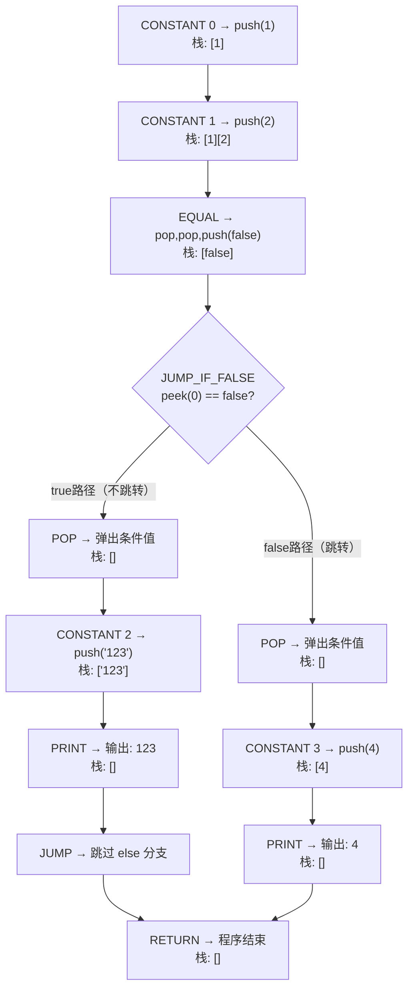

# if 语句编译与栈变化分析

以 `if (1 == 2) { print "123"; } else { print 4; }` 为例，从编译到执行完整追踪字节码和栈的变化。

---

## 编译后的字节码

### 常量池

| 索引 | 值 |
|------|----|
| 0 | `1` |
| 1 | `2` |
| 2 | `"123"` |
| 3 | `4` |

### 字节码布局

```
偏移:  0         1     2         3     4          5               6      7
字节: [CONSTANT] [0]  [CONSTANT] [1]  [EQUAL]   [JUMP_IF_FALSE] [0x00] [0x04]
       ~~~ 1 ~~~      ~~~ 2 ~~~        1==2?     如果false跳到偏移12

偏移:  8      9         10    11      12      13     14
字节: [POP]  [CONSTANT] [2]  [PRINT] [JUMP]  [0x00] [0x03]
       弹条件  ~"123"~   打印   跳到偏移18

偏移:  15     16        17     18      19
字节: [POP]  [CONSTANT] [3]   [PRINT] [RETURN]
       弹条件  ~~~ 4 ~~~  打印
```

### 对应的编译器代码（compiler.c ifStatement）

```c
// 编译 if 语句，使用 backpatching（回填）技术处理前向跳转
static void ifStatement()
{
    // 解析 if (condition) 语法结构
    consume(TOKEN_LEFT_PAREN, "Expect '(' after 'if'.");
    expression(); // 编译条件表达式，运行时结果会被压入栈顶
    consume(TOKEN_RIGHT_PAREN, "Expect ')' after condition.");

    // 发射条件跳转指令：如果栈顶值为 false，则跳过 then 分支
    int thenJump = emitJump(OP_JUMP_IF_FALSE);
    emitByte(OP_POP);      // true 路径：弹出条件值
    statement();            // 编译 then 分支
    int elseJump = emitJump(OP_JUMP);
    patchJump(thenJump);    // 回填 JUMP_IF_FALSE 的跳转距离
    emitByte(OP_POP);       // false 路径：弹出条件值
    if (match(TOKEN_ELSE))
        statement();        // 编译 else 分支
    patchJump(elseJump);    // 回填 JUMP 的跳转距离
}
```

---

## 实际执行路径（1 != 2，条件为 false，走 else 分支）

```
偏移 0-1: OP_CONSTANT 0
  → push(1)
  栈: [ 1 ]

偏移 2-3: OP_CONSTANT 1
  → push(2)
  栈: [ 1 ][ 2 ]

偏移 4: OP_EQUAL
  → pop 2, pop 1, 比较 1==2 → false, push(false)
  栈: [ false ]

偏移 5-7: OP_JUMP_IF_FALSE, offset=4
  → peek(0) = false → 条件为假
  → ip += 4, 跳到偏移 12
  → 注意：JUMP_IF_FALSE 只 peek 不 pop，条件值还在栈上
  栈: [ false ]

  ┌──────────────────────────────────┐
  │ 跳过了偏移 8-11（整个 then 分支） │
  └──────────────────────────────────┘

偏移 12: OP_POP
  → 弹出条件值 false（false 路径的清理）
  栈: [ ]

偏移 13-14: OP_CONSTANT 3
  → push(4)
  栈: [ 4 ]

偏移 15: OP_PRINT
  → pop() 并打印 → 输出: 4
  栈: [ ]

偏移 16: OP_RETURN
  → 程序结束
```

---

## 假设条件为 true 的路径（如 `if (1 == 1)`）

```
偏移 4: OP_EQUAL
  → 1==1 → true, push(true)
  栈: [ true ]

偏移 5-7: OP_JUMP_IF_FALSE, offset=4
  → peek(0) = true → 不跳转，继续执行
  栈: [ true ]       ← 条件值仍在栈上

偏移 8: OP_POP
  → 弹出条件值 true（true 路径的清理）
  栈: [ ]

偏移 9-10: OP_CONSTANT 2
  → push("123")
  栈: [ "123" ]

偏移 11: OP_PRINT
  → pop() 并打印 → 输出: 123
  栈: [ ]

偏移 12-14: OP_JUMP, offset=3
  → ip += 3, 跳到偏移 18
  栈: [ ]

  ┌──────────────────────────────────┐
  │ 跳过了偏移 15-17（整个 else 分支）│
  └──────────────────────────────────┘

偏移 18: OP_RETURN
  → 程序结束
```

---

## 为什么需要 OP_POP

`OP_JUMP_IF_FALSE` 在 VM 中的实现只**检查**栈顶值（`peek`），并不弹出它：

```c
case OP_JUMP_IF_FALSE: {
    uint16_t offset = READ_SHORT();
    if (isFalsey(peek(0)))   // peek，不是 pop
        vm.ip += offset;
    break;
}
```

因此条件值会留在栈上，必须由后续的 `OP_POP` 来清理。编译器在两条路径上各放了一个 `OP_POP`：

```
                    [ false ]  ← 条件值在栈上
                        |
            ┌───────────┴───────────┐
         true 路径              false 路径
            |                       |
      偏移8: POP              偏移12: POP ← JUMP_IF_FALSE 跳到这
      弹出条件值               弹出条件值
            |                       |
       then 分支               else 分支
     print "123"               print 4
            |                       |
      偏移12: JUMP             直接继续
      跳过 else                     |
            └───────────┬───────────┘
                     RETURN
                   栈始终平衡: [ ]
```

无论走哪条路径，栈最终都回到空的状态——这就是两个 `OP_POP` 存在的意义。

---

## 流程图


