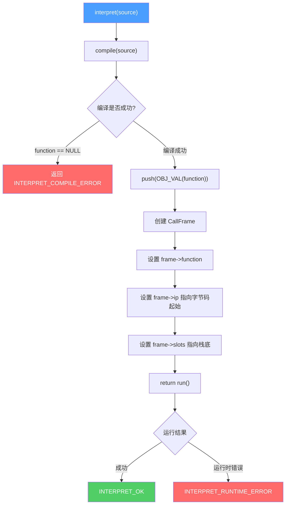
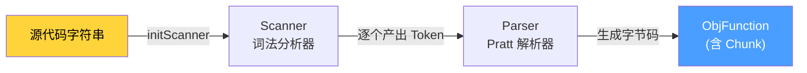
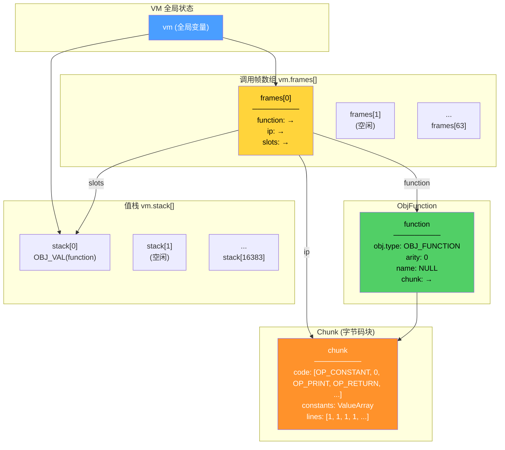
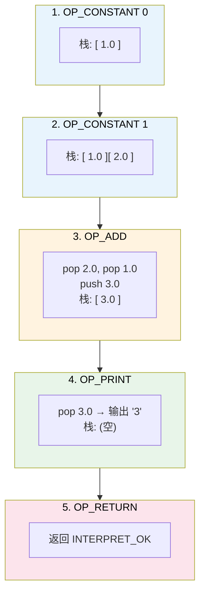

# `interpret()` 函数深度解析

## 源码

```c
InterpretResult interpret(const char *source)
{
    ObjFunction *function = compile(source);
    if (function == NULL)
        return INTERPRET_COMPILE_ERROR;

    push(OBJ_VAL(function));
    CallFrame *frame = &vm.frames[vm.frameCount++];
    frame->function = function;
    frame->ip = function->chunk.code;
    frame->slots = vm.stack;
    return run();
}
```

## 函数定位

`interpret()` 是整个 clox 虚拟机的**总入口函数**，它是**编译阶段**和**执行阶段**之间的桥梁。用户传入一段源代码字符串，该函数负责将其编译为字节码，再交给 VM 执行。

## 整体执行流程



## 逐行详解

### 第 1 步：编译源码

```c
ObjFunction *function = compile(source);
```

调用编译器，将源代码字符串编译为一个 `ObjFunction` 对象。这个对象包含：

| 字段 | 类型 | 含义 |
|------|------|------|
| `obj` | `Obj` | 对象头，包含类型标识和 GC 链表指针 |
| `arity` | `int` | 函数参数个数（顶层脚本为 0） |
| `chunk` | `Chunk` | 编译产生的字节码块（含指令数组、常量池、行号信息） |
| `name` | `ObjString*` | 函数名（顶层脚本为 NULL） |

`compile()` 内部的流程：



### 第 2 步：编译错误检查

```c
if (function == NULL)
    return INTERPRET_COMPILE_ERROR;
```

如果编译过程中发生语法错误（`parser.hadError == true`），`compile()` 返回 NULL，此时直接返回编译错误，不进入执行阶段。

### 第 3 步：将函数对象压入栈

```c
push(OBJ_VAL(function));
```

这一行做了两件事：

1. **`OBJ_VAL(function)`** — 将 C 指针包装成 `Value`：
   ```c
   // 展开后等价于：
   (Value){VAL_OBJ, {.obj = (Obj *)function}}
   ```

2. **`push(...)`** — 将这个 Value 压入 VM 的值栈：
   ```c
   void push(Value value) {
       *vm.stackTop = value;  // 写入栈顶位置
       vm.stackTop++;         // 栈顶指针上移
   }
   ```

**为什么要压栈？** 这是为了让 GC（垃圾回收器）能找到这个函数对象。如果函数对象只存在于 C 局部变量中，GC 在回收时无法追踪到它，可能会误回收。压入栈后，GC 扫描栈就能发现它。

### 第 4 步：创建调用帧 (CallFrame)

```c
CallFrame *frame = &vm.frames[vm.frameCount++];
frame->function = function;
frame->ip = function->chunk.code;
frame->slots = vm.stack;
```

这是函数调用机制的核心。逐字段解释：

| 赋值 | 含义 |
|------|------|
| `vm.frames[vm.frameCount++]` | 从调用帧数组中取下一个空闲帧，并递增帧计数 |
| `frame->function = function` | 记录当前帧执行的是哪个函数（用于访问其字节码和常量池） |
| `frame->ip = function->chunk.code` | 指令指针指向字节码数组的起始位置（即第一条指令） |
| `frame->slots = vm.stack` | 局部变量槽指向值栈的栈底（顶层脚本占据整个栈） |

### 第 5 步：执行字节码

```c
return run();
```

进入 VM 的取指-解码-执行（fetch-decode-execute）主循环，逐条执行字节码指令直到遇到 `OP_RETURN`。

## 关键数据结构的内存布局



## 完整生命周期时序图

```mermaid
sequenceDiagram
    participant User as 用户代码
    participant I as interpret()
    participant C as compile()
    participant Scanner as Scanner
    participant Parser as Parser
    participant VM_Stack as VM 值栈
    participant Frame as CallFrame
    participant R as run()

    User->>I: interpret("print 1+2;")
    I->>C: compile(source)
    C->>Scanner: initScanner(source)
    Scanner-->>C: 就绪

    loop 解析每条声明
        C->>Parser: declaration()
        Parser->>Scanner: advance() 获取 Token
        Scanner-->>Parser: Token
        Parser-->>C: 生成字节码写入 Chunk
    end

    C-->>I: 返回 ObjFunction*

    Note over I: 编译成功，function != NULL

    I->>VM_Stack: push(OBJ_VAL(function))
    Note over VM_Stack: stack[0] = function

    I->>Frame: 创建 CallFrame
    Note over Frame: ip → chunk.code[0]<br/>slots → stack[0]

    I->>R: run()

    loop 取指-解码-执行循环
        R->>R: instruction = READ_BYTE()
        R->>R: switch(instruction) 分派执行
        R->>VM_Stack: push / pop 操作
    end

    R-->>I: INTERPRET_OK
    I-->>User: 返回结果
```

## 具体示例：`print 1 + 2;`

假设输入源代码为 `print 1 + 2;`，以下是 `interpret()` 启动后的完整执行过程：

### 编译阶段产出

```
常量池: [0: 1.0,  1: 2.0]
字节码: OP_CONSTANT 0 | OP_CONSTANT 1 | OP_ADD | OP_PRINT | OP_RETURN
```

### 执行阶段栈变化



## 设计要点总结

| 设计决策 | 原因 |
|----------|------|
| 顶层代码包装为 `ObjFunction` | 统一处理：顶层脚本和函数调用使用相同的 CallFrame 机制 |
| 函数对象压栈 | GC 安全：确保编译产物不会被垃圾回收器误回收 |
| `frame->slots = vm.stack` | 顶层脚本的局部变量从栈底开始，嵌套函数调用时 slots 指向各自的栈窗口 |
| `frameCount++` 后置递增 | 先取当前空闲帧的索引，再递增计数，一步完成分配 |
| 返回 `run()` 的结果 | 将执行结果（OK / RUNTIME_ERROR）直接传递给调用者 |
