# 闭包实现全流程分析

## 一、什么是闭包

```lox
fun outer() {
  var x = "outside";
  fun inner() {
    print x;   // inner 引用了 outer 的局部变量 x
  }
  inner();
}
outer();
```

`inner` 函数访问了不属于自己作用域的变量 `x`，编译器和 VM 需要一套机制来"捕获"这个变量——这就是闭包（Closure）。

闭包的本质是：**函数 + 它所引用的外部环境**。当函数被当作值传递时，它需要"记住"定义时能访问的变量，即使那些变量所在的作用域已经结束。

---

## 二、核心数据结构

### 2.1 编译期结构

```c
// compiler.c:43-48
typedef struct {
    Token name;        // 变量名 token
    int depth;         // 作用域深度（-1 表示未初始化）
    bool isCaptured;   // 是否被某个闭包捕获（决定离开作用域时的处理方式）
} Local;

// compiler.c:50-54
typedef struct {
    uint8_t index;   // 被捕获变量的索引
    bool isLocal;    // true: 直接捕获外层局部变量
                     // false: 间接捕获外层的 upvalue（链式传递）
} Upvalue;

// compiler.c:62-72
typedef struct Compiler {
    struct Compiler *enclosing;    // 外层编译器（编译器栈，通过链表实现）
    ObjFunction *function;         // 正在编译的函数对象
    FunctionType type;             // TYPE_FUNCTION 或 TYPE_SCRIPT
    Local locals[UINT8_COUNT];     // 局部变量表（最多 256 个）
    int localCount;                // 当前局部变量数量
    Upvalue upvalues[UINT8_COUNT]; // 该函数捕获的 upvalue 描述表
    int scopeDepth;                // 当前作用域深度
} Compiler;
```

### 2.2 运行时结构

```c
// object.h:36-43 — 编译后的函数（字节码载体）
typedef struct {
    Obj obj;
    int arity;            // 参数数量
    int upvalueCount;     // 捕获的 upvalue 数量（编译期确定）
    Chunk chunk;          // 字节码 + 常量池
    ObjString *name;      // 函数名（NULL 表示顶层脚本）
} ObjFunction;

// object.h:62-69 — 上值对象（闭包的核心）
typedef struct ObjUpvalue {
    Obj obj;
    Value *location;           // 指向被捕获变量的位置（栈上或自身 closed 字段）
    Value closed;              // 变量离开栈后的存储位置
    struct ObjUpvalue *next;   // 开放上值链表的 next 指针
} ObjUpvalue;

// object.h:71-77 — 闭包对象（函数 + 捕获的环境）
typedef struct {
    Obj obj;
    ObjFunction *function;      // 底层函数对象
    ObjUpvalue **upvalues;      // upvalue 指针数组
    int upvalueCount;           // upvalue 数量
} ObjClosure;

// vm.h:16-21 — 调用帧
typedef struct {
    ObjClosure *closure;   // 注意：是 ObjClosure*，不是 ObjFunction*
    uint8_t *ip;           // 指令指针
    Value *slots;          // 该帧在值栈中的起始位置
} CallFrame;
```

### 2.3 VM 中的开放上值链表

```c
// vm.h:39
ObjUpvalue *openUpvalues;  // 开放上值链表头指针
```

VM 维护一个所有"开放"上值的有序链表，按栈地址**降序排列**（高地址在前）。

### 2.4 结构关系总览

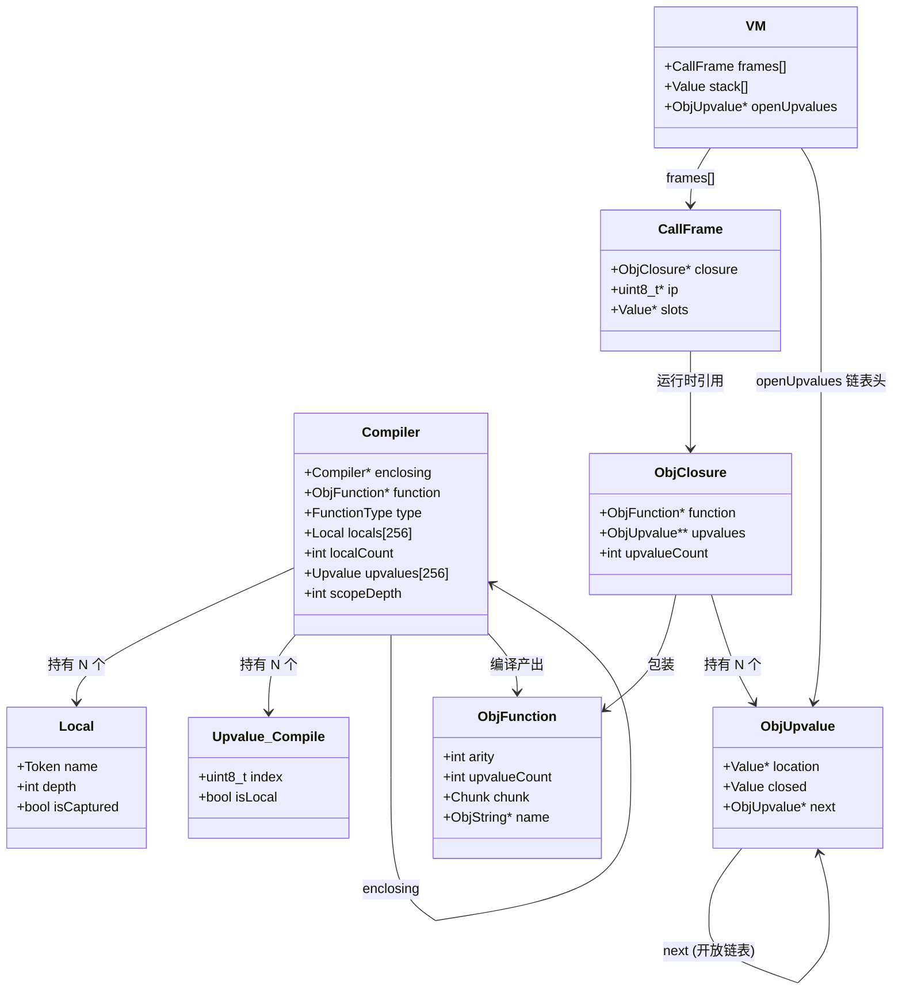

### 2.5 相关操作码

| 操作码 | 操作数 | 说明 |
|--------|--------|------|
| `OP_CLOSURE` | 1 字节(常量索引) + 每个 upvalue 2 字节 | 创建闭包对象，填充 upvalue 数组 |
| `OP_GET_UPVALUE` | 1 字节(upvalue 索引) | 通过 `upvalue->location` 读取被捕获变量 |
| `OP_SET_UPVALUE` | 1 字节(upvalue 索引) | 通过 `upvalue->location` 写入被捕获变量 |
| `OP_CLOSE_UPVALUE` | 无 | 关闭栈顶变量的上值（从栈迁移到堆） |

---

## 三、编译期流程

### 3.1 总体编译流程

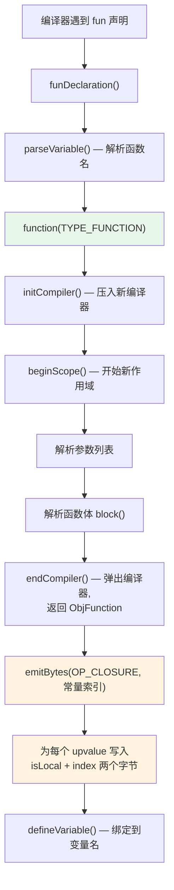

### 3.2 变量查找三级策略

当编译器遇到一个变量名时，`namedVariable()` 按以下优先级查找：

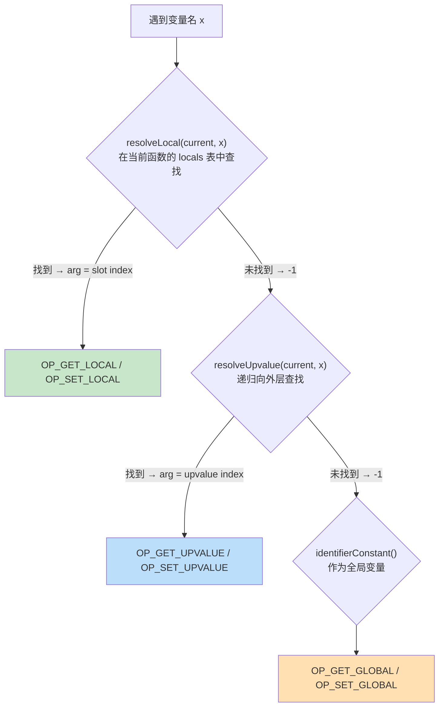

对应代码（`compiler.c:535`）：

```c
static void namedVariable(Token name, bool canAssign) {
    uint8_t getOp, setOp;
    int arg = resolveLocal(current, &name);
    if (arg != -1) {
        getOp = OP_GET_LOCAL;        // 第一级：本地变量
        setOp = OP_SET_LOCAL;
    } else if ((arg = resolveUpvalue(current, &name)) != -1) {
        getOp = OP_GET_UPVALUE;      // 第二级：upvalue
        setOp = OP_SET_UPVALUE;
    } else {
        arg = identifierConstant(&name);
        getOp = OP_GET_GLOBAL;       // 第三级：全局变量
        setOp = OP_SET_GLOBAL;
    }
    // ... 发射 get 或 set 指令
}
```

### 3.3 resolveLocal — 在当前函数中查找局部变量

```c
// compiler.c:389-405
static int resolveLocal(Compiler *compiler, Token *name) {
    // 从后往前遍历（优先找内层作用域的同名变量）
    for (int i = compiler->localCount - 1; i >= 0; i--) {
        Local *local = &compiler->locals[i];
        if (identifiersEqual(name, &local->name)) {
            if (local->depth == -1) {
                error("Can't read local variable in its own initializer.");
            }
            return i;   // 返回局部变量在 locals 数组中的索引（也是栈上的 slot 索引）
        }
    }
    return -1;  // 当前函数没有这个变量
}
```

### 3.4 resolveUpvalue — 递归向外层查找

这是闭包编译的**核心算法**，通过递归在编译器链中查找变量：

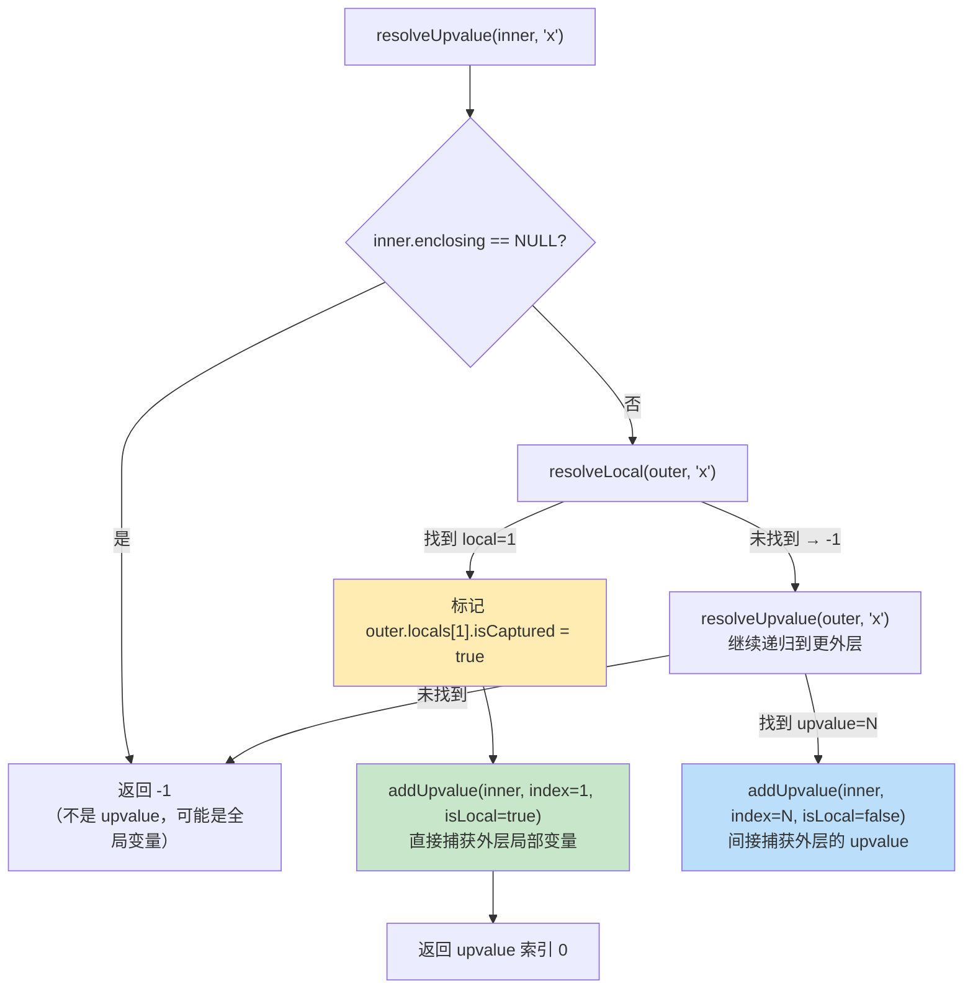

对应代码（`compiler.c:433-451`）：

```c
static int resolveUpvalue(Compiler *compiler, Token *name) {
    if (compiler->enclosing == NULL) return -1;  // 到顶了，不是 upvalue

    // 第一步：在直接外层函数中找局部变量
    int local = resolveLocal(compiler->enclosing, name);
    if (local != -1) {
        compiler->enclosing->locals[local].isCaptured = true;  // 标记被捕获！
        return addUpvalue(compiler, (uint8_t)local, true);      // isLocal = true
    }

    // 第二步：递归到更外层查找 upvalue
    int upvalue = resolveUpvalue(compiler->enclosing, name);
    if (upvalue != -1) {
        return addUpvalue(compiler, (uint8_t)upvalue, false);   // isLocal = false
    }

    return -1;
}
```

**递归的关键**：每一层中间函数都会通过 `addUpvalue` 添加一个 upvalue 条目，形成从最内层到变量定义层的"传递链"。

### 3.5 addUpvalue — 注册并去重

```c
// compiler.c:411-431
static int addUpvalue(Compiler *compiler, uint8_t index, bool isLocal) {
    int upvalueCount = compiler->function->upvalueCount;

    // 去重：如果已经捕获过同一个变量，直接返回已有索引
    for (int i = 0; i < upvalueCount; i++) {
        Upvalue *upvalue = &compiler->upvalues[i];
        if (upvalue->index == index && upvalue->isLocal == isLocal) {
            return i;
        }
    }

    if (upvalueCount == UINT8_COUNT) {
        error("Too many closure variables in function.");
        return 0;
    }

    compiler->upvalues[upvalueCount].isLocal = isLocal;
    compiler->upvalues[upvalueCount].index = index;
    return compiler->function->upvalueCount++;  // 同时递增 ObjFunction 中的计数
}
```

### 3.6 多层嵌套的链式传递

考虑三层嵌套：

```lox
fun outer() {
    var x = 1;
    fun middle() {
        fun inner() {
            print x;
        }
    }
}
```

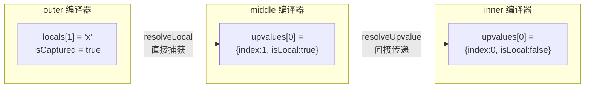

`resolveUpvalue` 的递归过程：

1. `resolveUpvalue(inner, "x")` → `resolveLocal(middle, "x")` → -1（middle 没有 x）
2. 递归 `resolveUpvalue(middle, "x")` → `resolveLocal(outer, "x")` → 找到 slot 1
3. `addUpvalue(middle, 1, isLocal=true)` → middle 得到 `upvalues[0] = {index:1, isLocal:true}`
4. 返回到 inner 层：`addUpvalue(inner, 0, isLocal=false)` → inner 得到 `upvalues[0] = {index:0, isLocal:false}`

### 3.7 OP_CLOSURE 字节码生成

`function()` 编译函数体结束后，在**外层函数**的字节码中生成 `OP_CLOSURE`：

```c
// compiler.c:883-889
ObjFunction *function = endCompiler();  // 弹出当前编译器，返回编译好的函数
emitBytes(OP_CLOSURE, makeConstant(OBJ_VAL(function)));  // 在外层函数中发射

// 紧跟 OP_CLOSURE 之后，为每个 upvalue 写入两个字节的描述
for (int i = 0; i < function->upvalueCount; i++) {
    emitByte(compiler.upvalues[i].isLocal ? 1 : 0);  // 是否直接捕获局部变量
    emitByte(compiler.upvalues[i].index);              // 变量索引
}
```

生成的字节码布局（**变长指令**）：

```
┌─────────────┬────────────────┬──────────┬────────┬──────────┬────────┬─────┐
│ OP_CLOSURE  │ constantIndex  │ isLocal₀ │ index₀ │ isLocal₁ │ index₁ │ ... │
└─────────────┴────────────────┴──────────┴────────┴──────────┴────────┴─────┘
  1 byte         1 byte          1 byte    1 byte    1 byte    1 byte
                                 ←── 每个 upvalue 2 字节 ──→
```

### 3.8 作用域退出：OP_CLOSE_UPVALUE vs OP_POP

当编译器退出一个作用域时，`endScope()` 根据 `isCaptured` 标志决定如何处理离开作用域的变量：

```c
// compiler.c:344-361
static void endScope() {
    current->scopeDepth--;
    while (current->localCount > 0 &&
           current->locals[current->localCount - 1].depth > current->scopeDepth)
    {
        if (current->locals[current->localCount - 1].isCaptured) {
            emitByte(OP_CLOSE_UPVALUE);  // 被捕获 → 提升值到堆上
        } else {
            emitByte(OP_POP);            // 未被捕获 → 直接弹出丢弃
        }
        current->localCount--;
    }
}
```

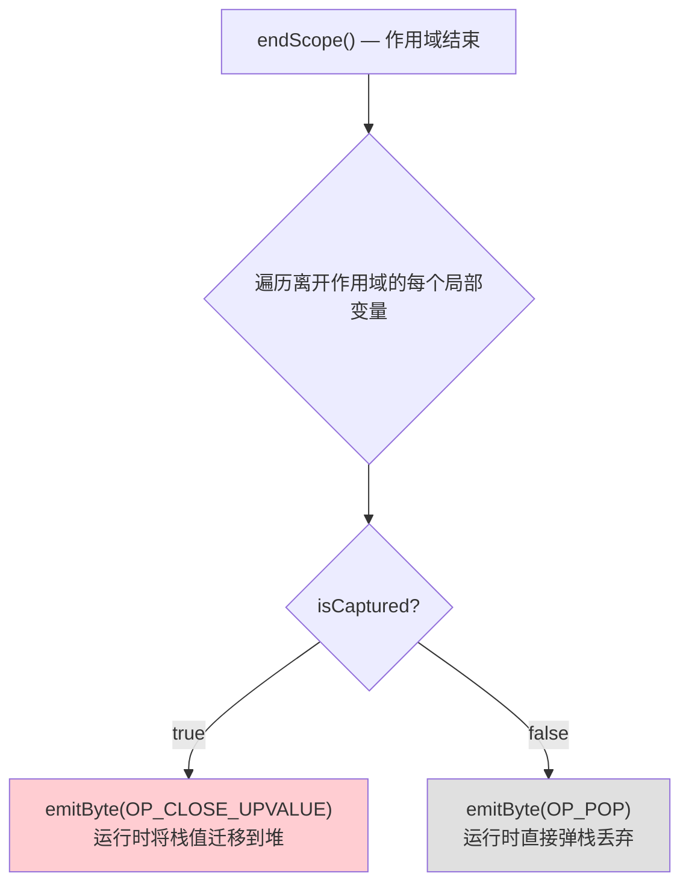

---

## 四、运行时流程

### 4.1 入口：一切皆闭包

即使是顶层脚本，也会被包装成闭包来执行：

```c
// vm.c:521-533
InterpretResult interpret(const char *source) {
    ObjFunction *function = compile(source);   // 编译得到 ObjFunction
    if (function == NULL) return INTERPRET_COMPILE_ERROR;

    push(OBJ_VAL(function));
    ObjClosure *closure = newClosure(function); // 包装成 ObjClosure（0 个 upvalue）
    pop();
    push(OBJ_VAL(closure));
    call(closure, 0);                           // 以闭包形式调用
    return run();
}
```

**设计意图**：`CallFrame` 统一持有 `ObjClosure*`，不需要在运行时区分"普通函数"和"闭包"。

### 4.2 newClosure — 创建闭包对象

```c
// object.c:24-37
ObjClosure *newClosure(ObjFunction *function) {
    // 分配 upvalue 指针数组，大小由编译期确定的 upvalueCount 决定
    ObjUpvalue **upvalues = ALLOCATE(ObjUpvalue *, function->upvalueCount);
    for (int i = 0; i < function->upvalueCount; i++) {
        upvalues[i] = NULL;  // 初始化为 NULL，后续由 OP_CLOSURE 填充
    }
    ObjClosure *closure = ALLOCATE_OBJ(ObjClosure, OBJ_CLOSURE);
    closure->function = function;
    closure->upvalues = upvalues;
    closure->upvalueCount = function->upvalueCount;
    return closure;
}
```

### 4.3 OP_CLOSURE — 创建闭包并捕获上值

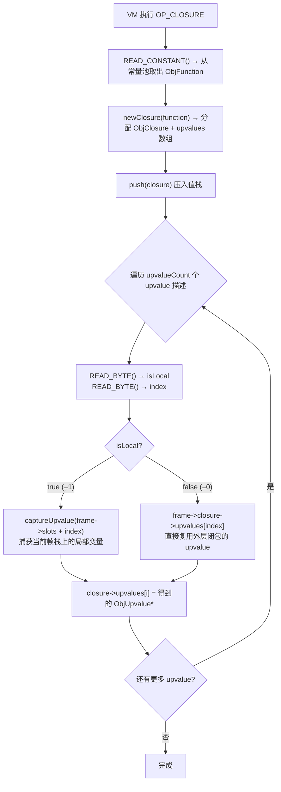

对应代码（`vm.c:469-488`）：

```c
case OP_CLOSURE: {
    ObjFunction *function = AS_FUNCTION(READ_CONSTANT());
    ObjClosure *closure = newClosure(function);
    push(OBJ_VAL(closure));
    for (int i = 0; i < closure->upvalueCount; i++) {
        uint8_t isLocal = READ_BYTE();
        uint8_t index = READ_BYTE();
        if (isLocal) {
            // 直接捕获：为当前帧的局部变量创建/复用 ObjUpvalue
            closure->upvalues[i] = captureUpvalue(frame->slots + index);
        } else {
            // 间接传递：从当前闭包的 upvalue 数组中继承
            closure->upvalues[i] = frame->closure->upvalues[index];
        }
    }
    break;
}
```

### 4.4 captureUpvalue — 创建或复用开放上值

这是运行时管理上值共享的核心函数。VM 维护一个按栈地址降序排列的**开放上值链表** (`vm.openUpvalues`)：

```c
// vm.c:127-153
static ObjUpvalue *captureUpvalue(Value *local) {
    ObjUpvalue *prevUpvalue = NULL;
    ObjUpvalue *upvalue = vm.openUpvalues;

    // 在有序链表中查找插入位置（按 location 降序）
    while (upvalue != NULL && upvalue->location > local) {
        prevUpvalue = upvalue;
        upvalue = upvalue->next;
    }

    // 如果已有指向同一栈槽的 upvalue，直接复用（共享！）
    if (upvalue != NULL && upvalue->location == local) {
        return upvalue;
    }

    // 否则创建新的 ObjUpvalue 并插入链表
    ObjUpvalue *createdUpvalue = newUpvalue(local);
    createdUpvalue->next = upvalue;

    if (prevUpvalue == NULL) {
        vm.openUpvalues = createdUpvalue;   // 插入链表头部
    } else {
        prevUpvalue->next = createdUpvalue; // 插入中间位置
    }
    return createdUpvalue;
}
```

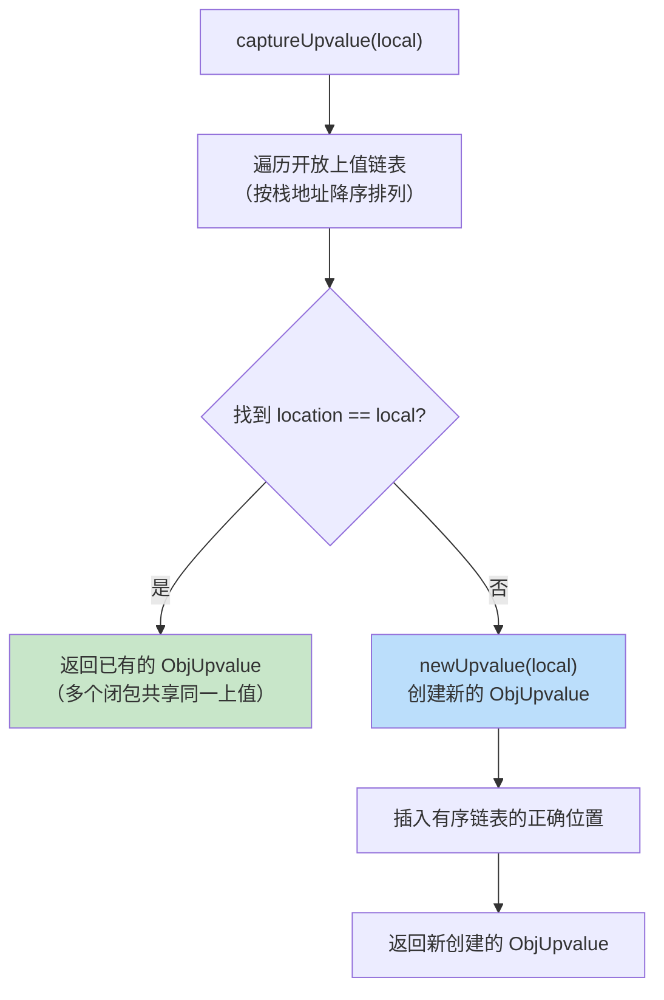

**共享的意义**：如果两个闭包都捕获了同一个变量，它们共享同一个 `ObjUpvalue` 对象。当其中一个闭包修改该变量时，另一个能看到变化。

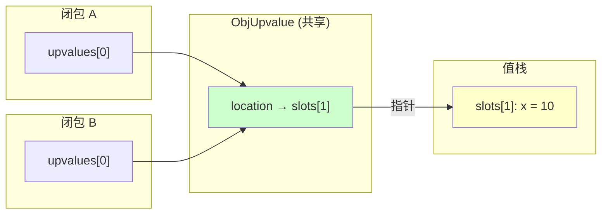

### 4.5 newUpvalue — 分配上值对象

```c
// object.c:85-92
ObjUpvalue *newUpvalue(Value *slot) {
    ObjUpvalue *upvalue = ALLOCATE_OBJ(ObjUpvalue, OBJ_UPVALUE);
    upvalue->closed = NIL_VAL;    // 初始化 closed 字段为 nil
    upvalue->location = slot;     // 指向栈上的变量
    upvalue->next = NULL;
    return upvalue;
}
```

### 4.6 OP_GET_UPVALUE / OP_SET_UPVALUE — 读写上值

```c
// vm.c:363-374
case OP_GET_UPVALUE: {
    uint8_t slot = READ_BYTE();
    push(*frame->closure->upvalues[slot]->location);   // 通过指针间接读取
    break;
}

case OP_SET_UPVALUE: {
    uint8_t slot = READ_BYTE();
    *frame->closure->upvalues[slot]->location = peek(0); // 通过指针间接写入
    break;
}
```

访问路径：`frame->closure->upvalues[slot]->location`，然后解引用 `location` 指针。这一层间接寻址是整个闭包设计的精髓（见第六节）。

### 4.7 closeUpvalues — 关闭上值（从栈迁移到堆）

当变量离开作用域或函数返回时，需要将栈上的值"提升"到堆上：

```c
// vm.c:155-165
static void closeUpvalues(Value *last) {
    while (vm.openUpvalues != NULL &&
           vm.openUpvalues->location >= last)
    {
        ObjUpvalue *upvalue = vm.openUpvalues;
        upvalue->closed = *upvalue->location;     // 1. 从栈拷贝值到 closed 字段
        upvalue->location = &upvalue->closed;     // 2. 重定向指针到自身的 closed
        vm.openUpvalues = upvalue->next;           // 3. 从开放链表中移除
    }
}
```

关闭过程的三个步骤：

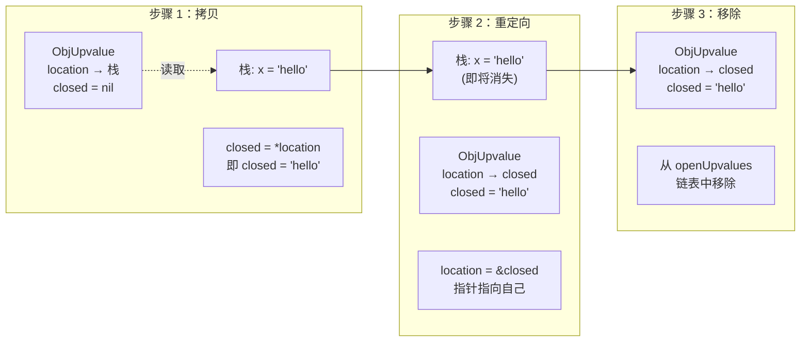

### 4.8 上值的两种状态

```
OPEN（开放）状态：                    CLOSED（关闭）状态：
┌──────────────────┐                 ┌──────────────────┐
│    ObjUpvalue     │                 │    ObjUpvalue     │
│                  │                 │                  │
│  location ──────────→ 栈上的值     │  location ──┐    │
│  closed = nil    │                 │  closed = val ←─┘    │
│  next = ...      │                 │  next = ...      │
└──────────────────┘                 └──────────────────┘
    变量还在栈上活着                      变量已离开栈，值保存在堆上
```

### 4.9 触发关闭的两个时机

**时机一：`OP_CLOSE_UPVALUE`** — 被捕获的局部变量离开作用域

```c
// vm.c:490-493
case OP_CLOSE_UPVALUE:
    closeUpvalues(vm.stackTop - 1);  // 关闭栈顶那个变量的上值
    pop();                            // 然后弹出该变量
    break;
```

由编译器在 `endScope()` 中为 `isCaptured == true` 的变量生成。

**时机二：`OP_RETURN`** — 函数返回时关闭整个帧的所有上值

```c
// vm.c:494-510
case OP_RETURN: {
    Value result = pop();
    closeUpvalues(frame->slots);     // 关闭该帧中所有剩余的开放上值
    vm.frameCount--;
    if (vm.frameCount == 0) {
        pop();
        return INTERPRET_OK;
    }
    vm.stackTop = frame->slots;
    push(result);
    frame = &vm.frames[vm.frameCount - 1];
    break;
}
```

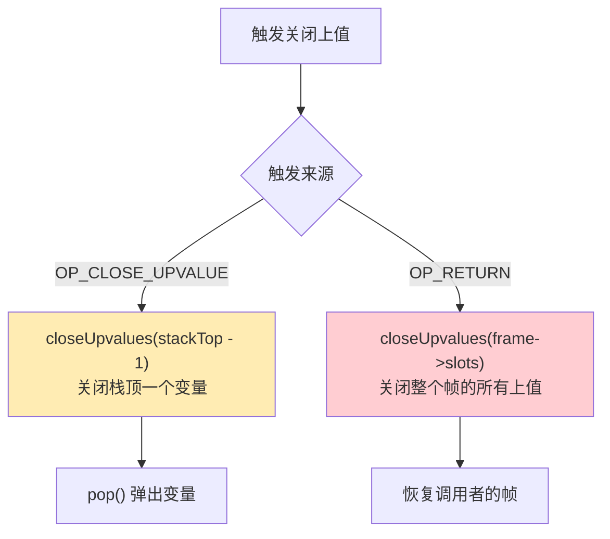

### 4.10 函数调用机制

```c
// vm.c:82-101
static bool call(ObjClosure *closure, int argCount) {
    if (argCount != closure->function->arity) { /* 参数数量错误 */ }
    if (vm.frameCount == FRAMES_MAX) { /* 栈溢出 */ }

    CallFrame *frame = &vm.frames[vm.frameCount++];
    frame->closure = closure;                         // 存储闭包引用
    frame->ip = closure->function->chunk.code;        // IP 指向函数字节码开头
    frame->slots = vm.stackTop - argCount - 1;        // 帧的栈窗口起始位置
    return true;
}

// vm.c:103-125 — callValue 只分发到 OBJ_CLOSURE
static bool callValue(Value callee, int argCount) {
    if (IS_OBJ(callee)) {
        switch (OBJ_TYPE(callee)) {
        case OBJ_CLOSURE:
            return call(AS_CLOSURE(callee), argCount);  // 只处理闭包！
        case OBJ_NATIVE: /* ... */
        }
    }
}
```

---

## 五、完整示例推演

### 5.1 示例代码

```lox
fun outer() {
  var x = "outside";
  fun inner() {
    print x;
  }
  inner();
}
outer();
```

### 5.2 编译期推演

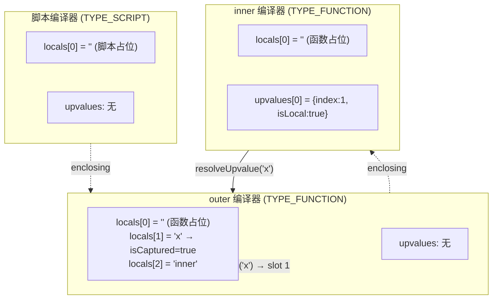

编译 inner 时遇到 `print x;` 中的 `x`：

1. `resolveLocal(inner, "x")` → -1（inner 没有局部变量 x）
2. `resolveUpvalue(inner, "x")`:
   - `resolveLocal(outer, "x")` → 找到 slot 1
   - 标记 `outer.locals[1].isCaptured = true`
   - `addUpvalue(inner, index=1, isLocal=true)` → 返回 upvalue index 0
3. 发射 `OP_GET_UPVALUE 0` 到 inner 的字节码

各函数生成的字节码：

```
== inner ==
  OP_GET_UPVALUE    0      // 读取 upvalue[0]（即外层的 x）
  OP_PRINT                 // 打印
  OP_NIL                   // 隐式返回 nil
  OP_RETURN

== outer ==
  OP_CONSTANT       "outside"     // push "outside"
  OP_CLOSURE        <inner_fn>    // 创建 inner 闭包
    local 1                       //   upvalue[0] 捕获 outer 的 slot 1（即 x）
  OP_CALL           0             // 调用 inner()
  OP_POP                          // 丢弃 inner() 的返回值
  OP_CLOSE_UPVALUE                // x 的 isCaptured=true，关闭上值
  OP_NIL
  OP_RETURN

== <script> ==
  OP_CLOSURE        <outer_fn>    // 创建 outer 闭包（0 个 upvalue）
  OP_DEFINE_GLOBAL  "outer"       // 定义全局变量 outer
  OP_GET_GLOBAL     "outer"       // 读取 outer
  OP_CALL           0             // 调用 outer()
  OP_POP                          // 丢弃返回值
  OP_NIL
  OP_RETURN
```

### 5.3 运行时推演

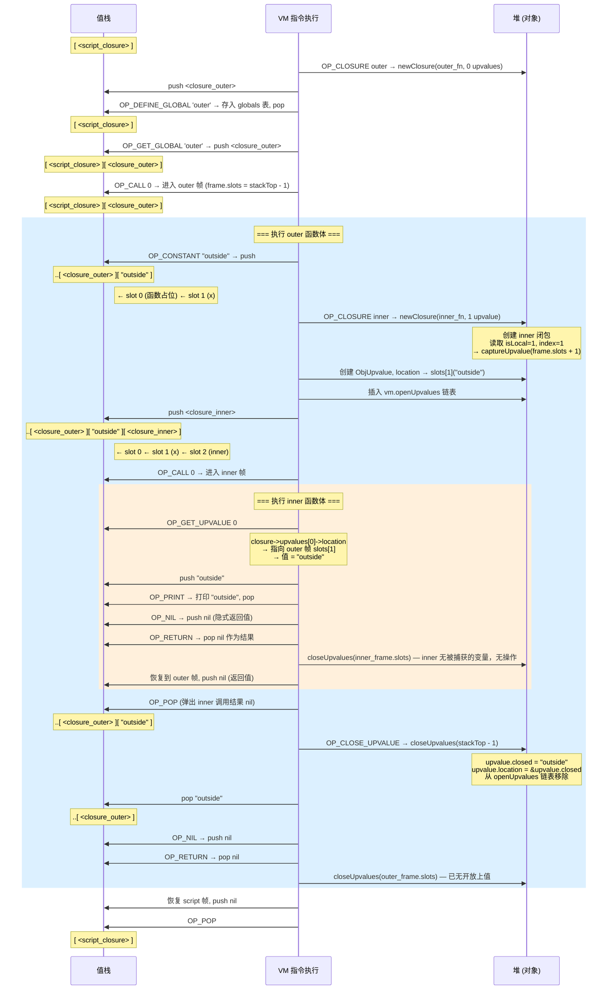

### 5.4 运行时内存关系快照

在 inner 函数执行 `OP_GET_UPVALUE 0` 那一刻的内存布局：

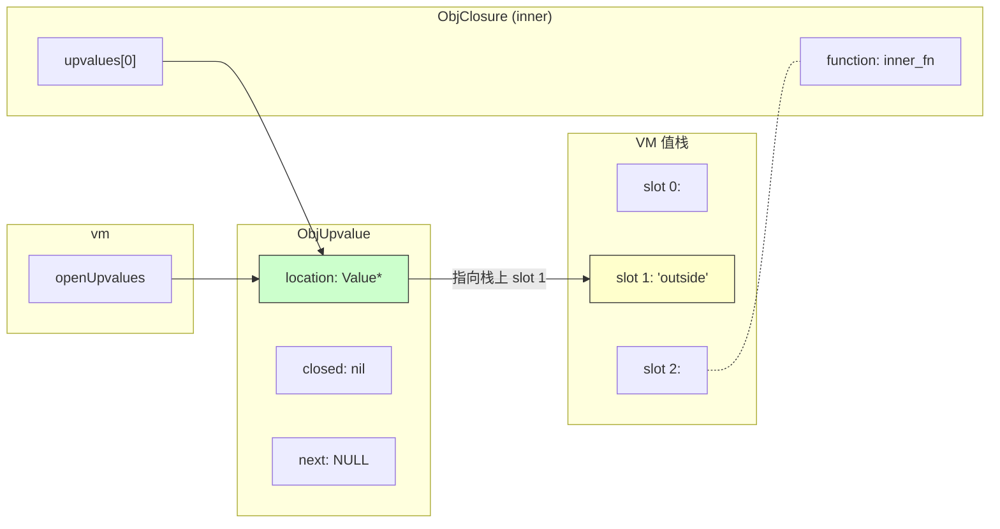

`OP_CLOSE_UPVALUE` 执行后：

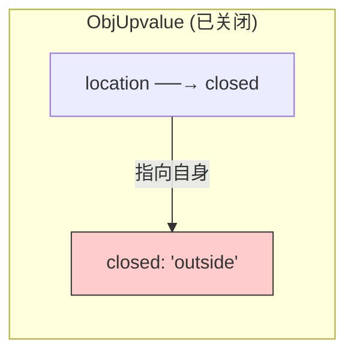

---

## 六、设计精华：双指针技巧

整个闭包实现最精妙之处在于 `ObjUpvalue.location` 这个**统一间接层**：

```
开放状态：                        关闭状态：
  location → 栈上的 Value          location → &self.closed
  closed = nil                     closed = 实际值
```

`OP_GET_UPVALUE` 和 `OP_SET_UPVALUE` 的实现只有一行核心逻辑：

```c
push(*frame->closure->upvalues[slot]->location);         // GET
*frame->closure->upvalues[slot]->location = peek(0);     // SET
```

**无需任何条件判断**——无论上值是开放还是关闭状态，`*location` 都能正确读写。关闭操作只是改变了 `location` 的指向目标，而读写代码完全不变。

这就是**指针间接层**的威力：通过一次指针重定向（O(1)），实现了从"栈上访问"到"堆上访问"的无缝切换，运行时零额外开销。

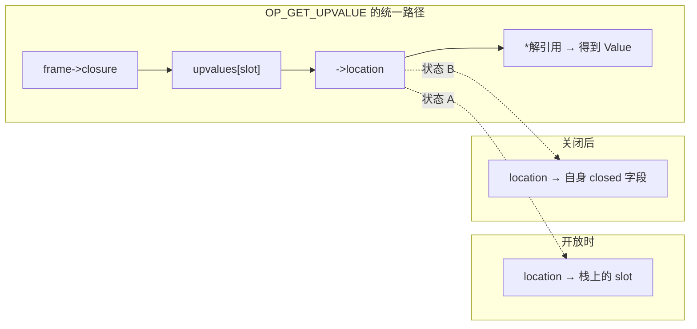

---

## 七、内存管理

### 7.1 对象创建

| 对象 | 创建函数 | 触发时机 |
|------|---------|---------|
| `ObjFunction` | `newFunction()` | 编译器 `initCompiler()` |
| `ObjClosure` | `newClosure(function)` | VM 执行 `OP_CLOSURE` 或 `interpret()` 入口 |
| `ObjUpvalue` | `newUpvalue(slot)` | `captureUpvalue()` 发现需要新建 |

### 7.2 对象销毁

```c
// memory.c:44-79
static void freeObject(Obj *object) {
    switch (object->type) {
    case OBJ_CLOSURE: {
        ObjClosure *closure = (ObjClosure *)object;
        FREE_ARRAY(ObjUpvalue *, closure->upvalues, closure->upvalueCount);
        // 只释放 upvalue 指针数组，不释放 ObjUpvalue 对象本身（它们独立管理）
        // 也不释放 ObjFunction（多个闭包可能共享同一个函数）
        FREE(ObjClosure, object);
        break;
    }
    case OBJ_FUNCTION: {
        ObjFunction *function = (ObjFunction *)object;
        freeChunk(&function->chunk);  // 释放字节码和常量池
        FREE(ObjFunction, object);
        break;
    }
    case OBJ_UPVALUE:
        FREE(ObjUpvalue, object);     // closed 字段是内联的，无需额外释放
        break;
    }
}
```

所有对象通过 `vm.objects` 链表统一追踪，`freeObjects()` 遍历释放。

### 7.3 对象生命周期总览

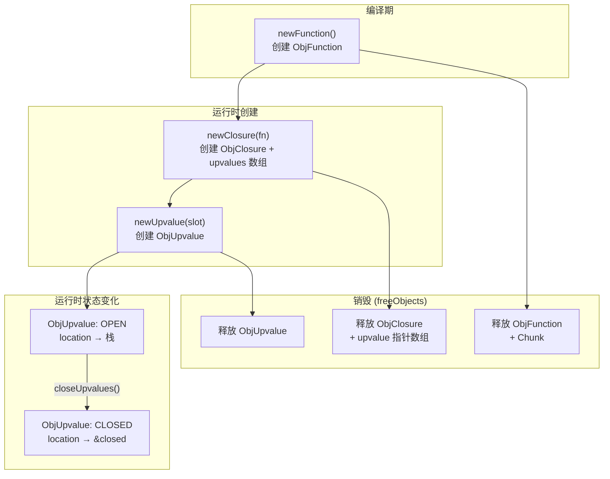

---

## 八、调试支持

反汇编器（`debug.c:121-138`）理解 `OP_CLOSURE` 的变长格式：

```c
case OP_CLOSURE: {
    offset++;
    uint8_t constant = chunk->code[offset++];
    printf("%-16s %4d ", "OP_CLOSURE", constant);
    printValue(chunk->constants.values[constant]);
    printf("\n");
    ObjFunction *function = AS_FUNCTION(chunk->constants.values[constant]);
    for (int j = 0; j < function->upvalueCount; j++) {
        int isLocal = chunk->code[offset++];
        int index = chunk->code[offset++];
        printf("%04d      |                     %s %d\n",
               offset - 2, isLocal ? "local" : "upvalue", index);
    }
    return offset;
}
```

输出示例：

```
0000    1 OP_CLOSURE          0 <fn inner>
0002      |                     local 1
```

---

## 九、总结：闭包全生命周期

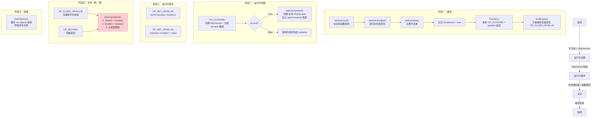

### 核心设计决策总结

| 设计决策 | 具体做法 | 优势 |
|---------|--------|------|
| **统一包装** | 所有函数（包括顶层脚本）都包装成 `ObjClosure` | `CallFrame` 统一持有 `ObjClosure*`，无需运行时类型判断 |
| **指针间接访问** | `ObjUpvalue.location` 是 `Value*` 指针 | 开放/关闭状态切换只改指针方向，读写代码零变更 |
| **链式传递** | `isLocal=false` 时复用外层闭包的 upvalue | 支持任意深度的嵌套闭包，每层只加一次间接引用 |
| **共享上值** | `captureUpvalue()` 去重，同一栈槽只创建一个 `ObjUpvalue` | 多个闭包捕获同一变量时共享状态，修改互相可见 |
| **编译期去重** | `addUpvalue()` 检查重复 | 同一变量被多次引用只创建一个 upvalue 条目 |
| **有序链表** | `openUpvalues` 按栈地址降序排列 | `closeUpvalues()` 能高效地从链表头开始批量关闭 |
| **延迟关闭** | 只在变量真正离开作用域时才关闭 | 开放期间直接访问栈上值，避免不必要的堆分配 |
| **变长指令** | upvalue 元数据紧跟 `OP_CLOSURE` 操作码 | 无需额外查表，VM 顺序读取字节流即可构建闭包 |
