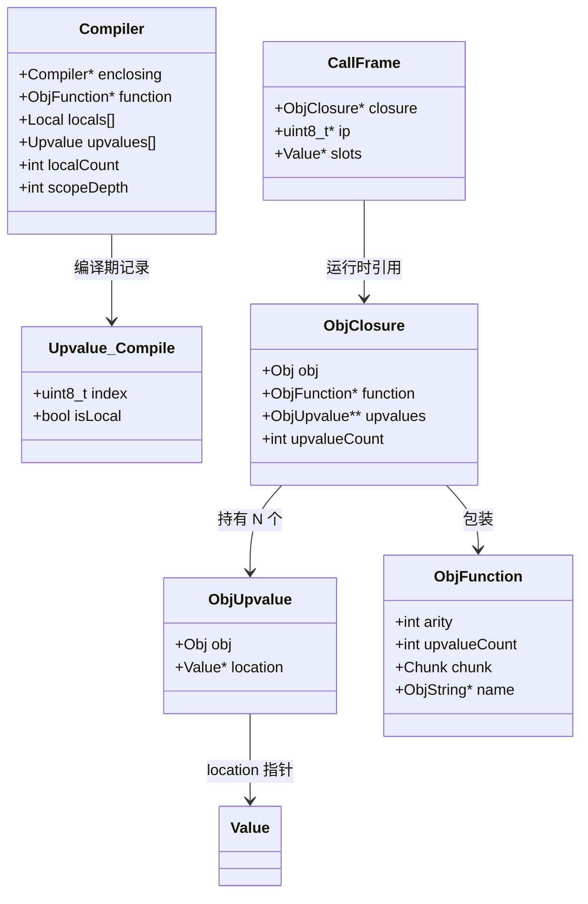
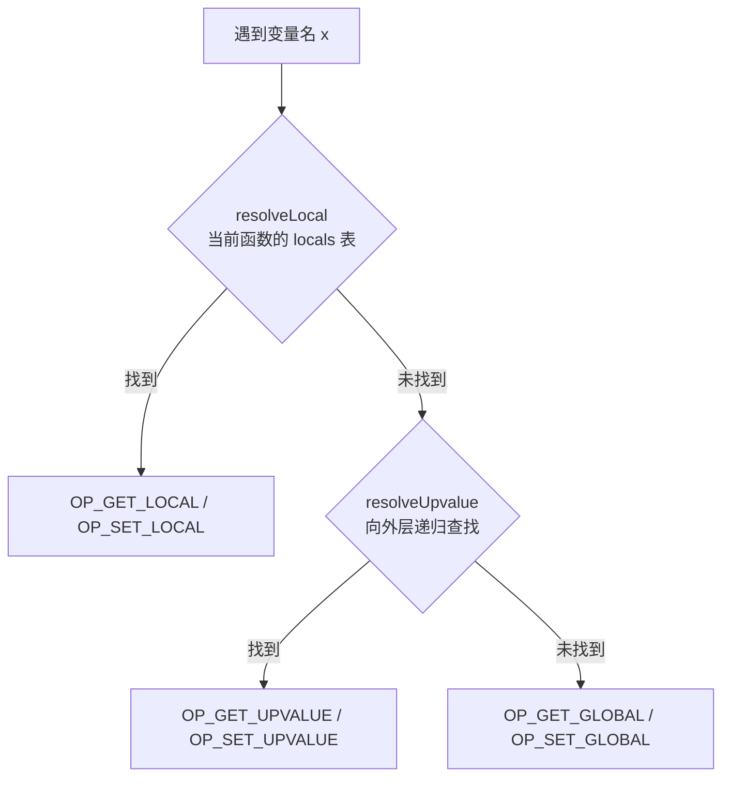
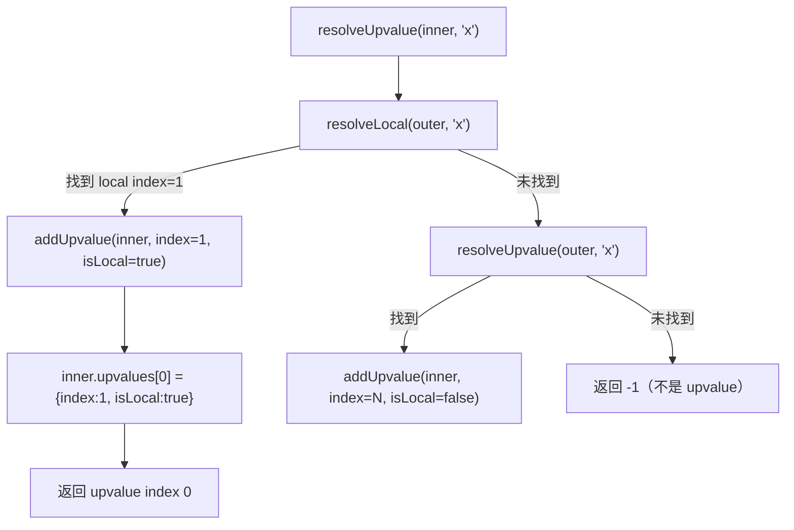
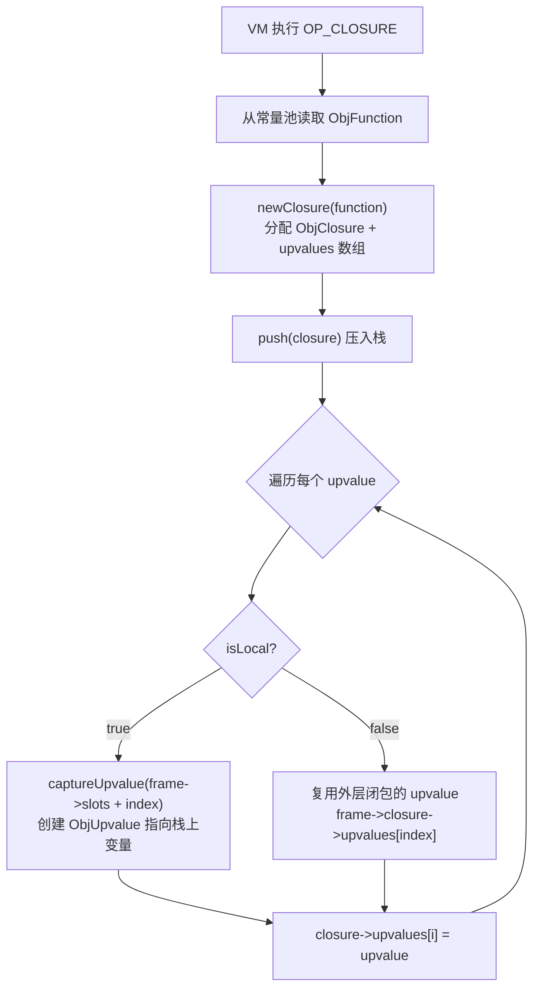
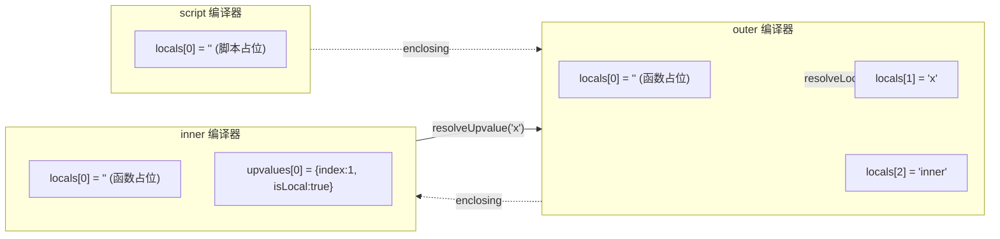
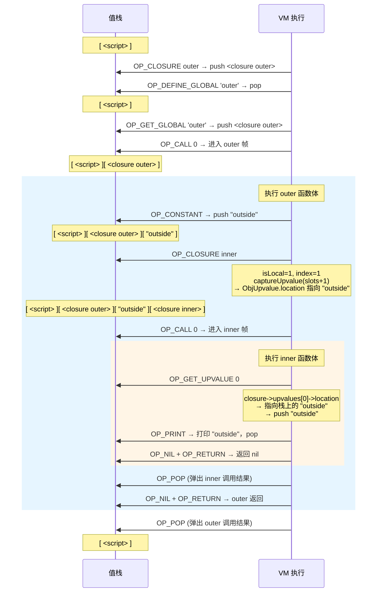
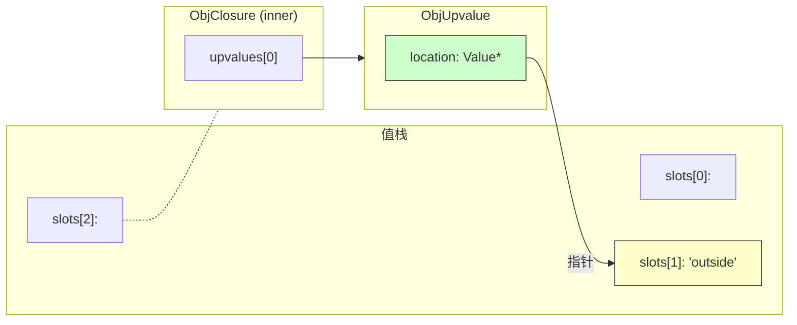
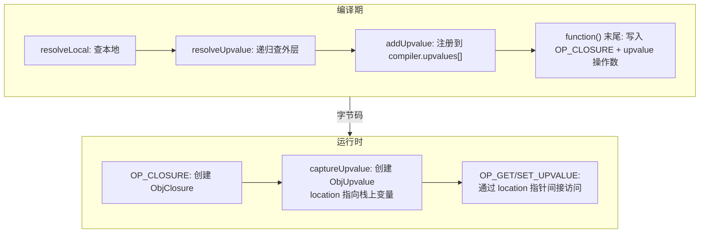

# 闭包实现全流程分析

## 一、什么是闭包问题

```js
fun outer() {
  var x = "outside";
  fun inner() {
    print x;   // inner 引用了 outer 的局部变量 x
  }
  inner();
}
outer();
```

`inner` 函数访问了不属于自己作用域的变量 `x`，编译器和 VM 需要一套机制来"捕获"这个变量——这就是闭包（Closure）。

---

## 二、核心数据结构

### 2.1 编译期结构

```c
// compiler.c
typedef struct {
    uint8_t index;   // 被捕获变量的索引
    bool isLocal;    // true: 捕获的是直接外层的局部变量
                     // false: 捕获的是外层的 upvalue（链式传递）
} Upvalue;

typedef struct Compiler {
    struct Compiler *enclosing;    // 外层编译器（编译器栈）
    ObjFunction *function;
    FunctionType type;
    Local locals[UINT8_COUNT];     // 局部变量表
    int localCount;
    Upvalue upvalues[UINT8_COUNT]; // 该函数捕获的 upvalue 记录
    int scopeDepth;
} Compiler;
```

### 2.2 运行时结构

```c
// object.h
typedef struct ObjUpvalue {
  Obj obj;
  Value *location;    // 指向被捕获变量在栈上的位置
} ObjUpvalue;

typedef struct {
  Obj obj;
  ObjFunction *function;      // 底层函数对象
  ObjUpvalue **upvalues;      // upvalue 指针数组
  int upvalueCount;
} ObjClosure;
```

### 2.3 调用帧

```c
// vm.h
typedef struct {
  ObjClosure *closure;   // 注意：不是 ObjFunction*，而是 ObjClosure*
  uint8_t *ip;
  Value *slots;
} CallFrame;
```

### 2.4 结构关系图



---

## 三、编译期流程

### 3.1 变量查找三级策略

当编译器遇到一个变量名时，`namedVariable()` 按以下优先级查找：



对应代码（`compiler.c:524`）：

```c
static void namedVariable(Token name, bool canAssign) {
    int arg = resolveLocal(current, &name);
    if (arg != -1) {
        getOp = OP_GET_LOCAL;       // 第一级：本地变量
    } else if ((arg = resolveUpvalue(current, &name)) != -1) {
        getOp = OP_GET_UPVALUE;     // 第二级：upvalue
    } else {
        getOp = OP_GET_GLOBAL;      // 第三级：全局变量
    }
}
```

### 3.2 resolveUpvalue 递归查找



对应代码（`compiler.c:424`）：

```c
static int resolveUpvalue(Compiler *compiler, Token *name) {
    if (compiler->enclosing == NULL) return -1;

    // 先在直接外层找局部变量
    int local = resolveLocal(compiler->enclosing, name);
    if (local != -1) {
        return addUpvalue(compiler, (uint8_t)local, true);  // isLocal = true
    }

    // 再递归到更外层找 upvalue
    int upvalue = resolveUpvalue(compiler->enclosing, name);
    if (upvalue != -1) {
        return addUpvalue(compiler, (uint8_t)upvalue, false); // isLocal = false
    }

    return -1;
}
```

### 3.3 addUpvalue 去重注册

```c
static int addUpvalue(Compiler *compiler, uint8_t index, bool isLocal) {
    int upvalueCount = compiler->function->upvalueCount;

    // 去重：如果已经捕获过同一个变量，直接返回已有索引
    for (int i = 0; i < upvalueCount; i++) {
        Upvalue *upvalue = &compiler->upvalues[i];
        if (upvalue->index == index && upvalue->isLocal == isLocal) {
            return i;
        }
    }

    compiler->upvalues[upvalueCount].isLocal = isLocal;
    compiler->upvalues[upvalueCount].index = index;
    return compiler->function->upvalueCount++;
}
```

### 3.4 OP_CLOSURE 字节码生成

`function()` 编译结束后，生成 `OP_CLOSURE` 及其 upvalue 操作数：

```c
ObjFunction *function = endCompiler();
emitBytes(OP_CLOSURE, makeConstant(OBJ_VAL(function)));

// 紧跟 OP_CLOSURE 之后，为每个 upvalue 写入两个字节
for (int i = 0; i < function->upvalueCount; i++) {
    emitByte(compiler.upvalues[i].isLocal ? 1 : 0);  // 是否直接捕获局部变量
    emitByte(compiler.upvalues[i].index);              // 变量索引
}
```

生成的字节码布局：

```
OP_CLOSURE  constantIndex  [isLocal₀ index₀]  [isLocal₁ index₁]  ...
```

---

## 四、运行时流程

### 4.1 OP_CLOSURE：创建闭包并捕获变量



对应代码（`vm.c:434`）：

```c
case OP_CLOSURE: {
    ObjFunction *function = AS_FUNCTION(READ_CONSTANT());
    ObjClosure *closure = newClosure(function);
    push(OBJ_VAL(closure));
    for (int i = 0; i < closure->upvalueCount; i++) {
        uint8_t isLocal = READ_BYTE();
        uint8_t index = READ_BYTE();
        if (isLocal) {
            // 直接捕获外层栈上的局部变量
            closure->upvalues[i] = captureUpvalue(frame->slots + index);
        } else {
            // 从外层闭包的 upvalues 中传递
            closure->upvalues[i] = frame->closure->upvalues[index];
        }
    }
    break;
}
```

### 4.2 captureUpvalue：创建 upvalue 对象

```c
static ObjUpvalue *captureUpvalue(Value *local) {
    ObjUpvalue *createdUpvalue = newUpvalue(local);
    return createdUpvalue;
}
```

`newUpvalue` 分配一个 `ObjUpvalue`，其 `location` 指针直接指向栈上变量的地址：

```c
ObjUpvalue *newUpvalue(Value *slot) {
    ObjUpvalue *upvalue = ALLOCATE_OBJ(ObjUpvalue, OBJ_UPVALUE);
    upvalue->location = slot;
    return upvalue;
}
```

### 4.3 OP_GET_UPVALUE / OP_SET_UPVALUE

```c
case OP_GET_UPVALUE: {
    uint8_t slot = READ_BYTE();
    push(*frame->closure->upvalues[slot]->location);  // 通过指针间接读取
    break;
}

case OP_SET_UPVALUE: {
    uint8_t slot = READ_BYTE();
    *frame->closure->upvalues[slot]->location = peek(0);  // 通过指针间接写入
    break;
}
```

### 4.4 函数调用：所有函数都包装成闭包

```c
// interpret() 入口——顶层脚本也包装成闭包
ObjFunction *function = compile(source);
push(OBJ_VAL(function));
ObjClosure *closure = newClosure(function);
pop();
push(OBJ_VAL(closure));
call(closure, 0);

// callValue() 分派——只处理 OBJ_CLOSURE
case OBJ_CLOSURE:
    return call(AS_CLOSURE(callee), argCount);
```

`CallFrame` 持有的始终是 `ObjClosure*`，统一了有无 upvalue 的函数处理方式。

---

## 五、完整示例推演

以开头的代码为例：

```js
fun outer() {
  var x = "outside";
  fun inner() {
    print x;
  }
  inner();
}
outer();
```

### 5.1 编译期



inner 编译时遇到 `x`：
1. `resolveLocal(inner, "x")` → -1（inner 没有 x）
2. `resolveUpvalue(inner, "x")` → `resolveLocal(outer, "x")` → 找到 index=1
3. `addUpvalue(inner, index=1, isLocal=true)` → upvalue index=0

生成的字节码：
- inner: `OP_GET_UPVALUE 0` → `OP_PRINT`
- outer: `OP_CONSTANT "outside"` → `OP_CLOSURE <inner> [isLocal=1, index=1]` → `OP_CALL 0`

### 5.2 运行时栈变化



### 5.3 运行时内存关系



**关键点**：`ObjUpvalue.location` 是一个指针，直接指向栈上 `"outside"` 所在的 slot，读写 upvalue 就是通过这个指针间接访问栈上的值。

---

## 六、闭包相关的内存管理

### 创建

| 对象 | 创建函数 | 触发时机 |
|------|---------|---------|
| `ObjClosure` | `newClosure(function)` | VM 执行 `OP_CLOSURE` |
| `ObjUpvalue` | `newUpvalue(slot)` | `captureUpvalue()` |

### 销毁

```c
// memory.c - freeObject()
case OBJ_CLOSURE: {
    ObjClosure *closure = (ObjClosure *)object;
    FREE_ARRAY(ObjUpvalue *, closure->upvalues, closure->upvalueCount); // 释放指针数组
    FREE(ObjClosure, object);  // 释放闭包对象本身（不释放 function，function 独立管理）
    break;
}

case OBJ_UPVALUE:
    FREE(ObjUpvalue, object);  // 只释放 upvalue 对象，不释放它指向的值
    break;
```

---

## 七、总结：闭包处理的设计要点



| 设计决策 | 做法 | 好处 |
|---------|------|------|
| 统一包装 | 所有函数（包括顶层脚本）都包装成 `ObjClosure` | `CallFrame` 结构统一，不需要区分普通函数和闭包 |
| 指针间接访问 | `ObjUpvalue.location` 是 `Value*` 指针 | 读写 upvalue 就是解引用指针，开销极小 |
| 链式传递 | `isLocal=false` 时复用外层闭包的 upvalue | 支持任意深度的嵌套闭包 |
| 编译期去重 | `addUpvalue` 检查重复 | 同一变量被多次引用只创建一个 upvalue |
| 字节码内联 | upvalue 元数据紧跟 `OP_CLOSURE` | 无需额外查表，VM 顺序读取即可 |
